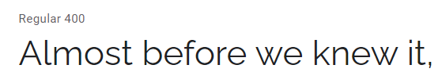
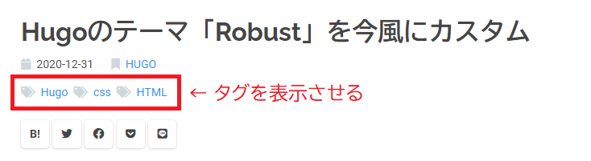
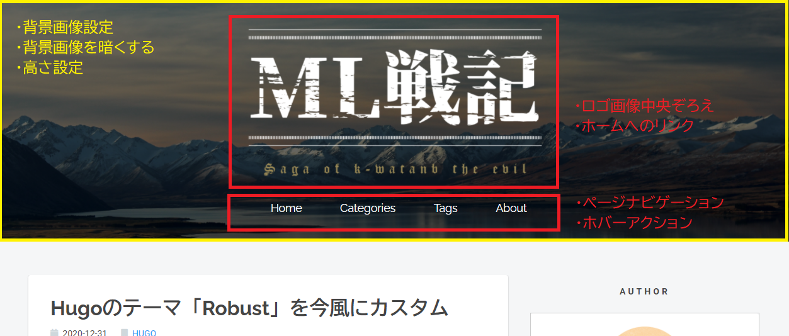

本ブログでは Hugo の [Robust](https://github.com/dim0627/hugo_theme_robust) というテーマを拝借しています。バニラ状態でも十分素晴らしいデザインですが、個人的にカスタマイズしたところをメモしておきます。

## フォントをユニバーサルデザインに

和文フォントには **"BIZ UDGothic"**, 欧文フォントの本文に **"Roboto"**, 欧文フォントのヘッダには **"Raleway"** を採用しました。

現在の Windows 10 にはユニバーサルデザインのフォントである "BIZ UDGothic" が標準搭載されています。視認性・可読性に優れており、大変すばらしいフォントです。

ただ欧文には少し癖があるので、欧文フォント本文は Google Font より "Roboto"、ヘッダ部にはより映える  "Raleway" を採用しました。


*Raleway はおしゃれなのでヘッダ映えしますね。Wが特徴的です。*

以下のコードを `/hugo_theme_robust/assets/styles.scss` に追記/修正しました。Mac の方向けにはヒラギノを指定しています。

```scss
@import url("https://fonts.googleapis.com/css2?family=Raleway:wght@400;500;600;700&family=Roboto:wght@400;500;700&display=swap");

body, p, html, ul, ol, ul > li, ol > li {
  font-family: "Roboto", "BIZ UDGothic", "Hiragino Kaku Gothic Pro", "Meiryo", sans-serif !important;
}

h1, h2, h3, h4, h5 ,h6 {
  font-family: "Raleway", "BIZ UDGothic", "Hiragino Kaku Gothic Pro", "Meiryo", sans-serif;
  font-weight: 700;
}

```

## 記事ヘッダにタグ一覧を表示

デフォルトでは記事ヘッダにタグが表示されていないので、表示させました。



```/hugo_theme_robust/layouts/_default/summary.html``` のヘッダ内にタグを表示させるように追記しました。

```html
<head>

<ul class="facts">
...
</ul>

<!-- タグ追記 -->
<ul class="facts_tags">
  {{ range .Params.tags }}
  <li><i class="fas fa-tags" aria-hidden="true"></i><a href="{{ $.Site.BaseURL }}tags/{{ . | urlize }}">{{ . }}</a> </li>
  {{ end }}
</ul>

{{ partial "share.html" . }}

</head>

```

css は以下のように設定しました。

リンクオーバーで線が出てきます。記事内のリンクにも同様に追記しました。

```scss
ul.facts, ul.facts_tags{

  margin: 0;
  padding: 0;

  li {
    display: inline;  // 横に並べる
    font-size: .8rem;
  }

  i {
    color: #cfd8dc;
    margin-right: .5em;
  }

  &.sm li {
    font-size: .7rem;
  }

  a {
    position: relative;
    display: inline-block;
    transition: .3s;

    // リンク中央下から線を出す
    &:after{
      position: absolute;
      bottom: -0.05rem;
      left: 50%;
      content: '';
      width: 0;
      height: 1px;
      background-color: $blue;
      transition: .3s;
      -webkit-transform: translateX(-50%);
      transform: translateX(-50%);
    }
    &:hover::after{
      width: 100%;    
    }
  }
}

ul.facts > li{
  margin-right: 1rem;
}

ul.facts_tags {
  margin: 0.5rem 0rem 1.3rem 0rem;
  line-height: 1.3rem;
  li{
    margin-right: .2rem;
  }
}
```

ついでにフッターも同様のレイアウトに修正しました。


```html
<footer class="article-footer">

  <ul class="facts_tags">

    <!-- カテゴリ -->
    {{ with .Section }}
    <li><i class="fas fa-bookmark" aria-hidden="true"></i><a href="{{ $.Site.BaseURL }}{{ . | urlize }}/">{{ . | upper }}</a></li>
    {{ end }}

    <!-- タグ -->
    {{ range .Params.tags }}
      <li><i class="fas fa-tags" aria-hidden="true"></i><a href="{{ $.Site.BaseURL }}tags/{{ . | urlize }}">{{ . }}</a> </li>
    {{ end }}

  </ul>

  {{ partial "share.html" . }}

</footer>

```

## 記事のヘッダデザインを変更

以下のように変更しました。

```scss
article.sn > .article-body h2 {
  font-size: 1.4rem;
  line-height: 1.5rem;
  margin: 1.5rem 0;
  padding: 1.0rem 1.2rem;
  border-left: .5rem solid $gray;
  background: #f4f4f4;
}

article.sn > .article-body h3 {
  font-size: 1.2rem;
  line-height: 1.5rem;
  margin: 1.5rem 0;
  padding: .5rem .1rem;
  border-bottom: 3px dashed $gray;
  font-weight: 700;
}

article.sn > .article-body h4 {
  font-size: 1.1rem;
  line-height: 1.5rem;
  /*margin: 0.5rem 0;*/
  padding: .5rem .1rem;
  font-weight: 700;

  &:before{
    content: '■ ';
  }
}
```

## 記事内のサムネイルの表示制御

記事冒頭にサムネイルを表示させるかを ```config.toml``` で制御できるようにしました。```/hugo_theme_robust/layouts/_default/summary.html``` の冒頭に if を追記してください。

```html
{{ if .Site.Params.Posts.show_thumb_post | default false}}
    <div class="thumb thumb-{{ .File.UniqueID }}"></div>
{{ end }}
```
```config.toml``` では以下のように制御できます。

```toml
[params]
show_thumb_post = false
```

## 固定ヘッダ/ナビゲーションを追加



固定ヘッダとページナビゲーションを追加しました。```/hugo_theme_robust/layouts/_default/baseof.html``` のヘッダー部を以下のように修正しました。

```html
    <header class="l-header">
      <div class="title-logo-wrapper">
          
        <!-- ロゴ画像 -->
        <h1 class="logo">
          <a href="{{ .Site.BaseURL }}"></a>
        </h1>

        <!-- ナビゲーション -->
        <nav class="topnav">
          <ul class="topnav_menu">

            <li class="topnav_menu_item"><a href="/">Home</a></li>
            <li class="topnav_menu_item"><a href="/categories">Categories</a></li>
            <li class="topnav_menu_item"><a href="/tags">Tags</a></li>
            <li class="topnav_menu_item"><a href="/about">About</a></li>
          </ul>
        </nav>
      </div>
    </header>
```

css は以下のようにしました。

```scss
// ヘッダー
.l-header{

  padding-top: 2rem;
  height: 20rem;

  background: url("/images/tobias-keller-73F4pKoUkM0-unsplash.jpg") no-repeat center;
  background-size: cover;
  position: relative;

  // 背景暗くする
  &:before{
    content: ' ';
    background-color: rgba(0, 0, 0, .6);
    position: absolute;
    top: 0;
    right: 0;
    bottom: 0;
    left: 0;
  }
}

.title-logo-wrapper {

  position: relative; // 浮かせる（背景を暗くする影響を受けないため）
  max-width: 30rem;

  display: flex;
  flex-direction: column;
  margin: 0 auto; // 中央揃え

  .logo a {
    img{
      max-width: 30rem;   // 書かないとダメ
    }
  }

  .topnav {

    .topnav_menu_item{
      display: inline;  // 横に並べる
      margin: 0 0.3rem;
    }

    a {
      font-family: "Raleway", "BIZ UDGothic", "Hiragino Kaku Gothic Pro", "Meiryo", sans-serif;
      color: #FFF;
      padding: 0.7rem 1.3rem;

      border-radius: 2rem;
      transition: all .3s;

      &:hover{
        background-color: #2196f3;
      }

    }


  }
}

```


## トップページ記事にホバーアクションを追加


## カテゴリとタグのデザインを柔らかく


## ページナビゲーションにホバーアクションを追加


## Copyright を変更