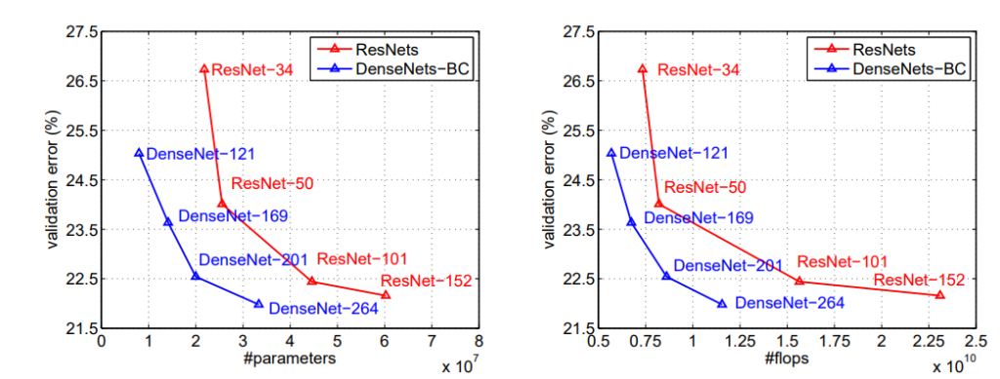

[arxiv](https://arxiv.org/abs/1608.06993), [github(official)](https://github.com/liuzhuang13/DenseNet), [keras(pretrained)](https://keras.io/api/applications/densenet/#densenet121-function), [pytorch(pretrained)](https://pytorch.org/hub/pytorch_vision_densenet/)

## どんなもの？

ResNetsにインスパイアされた、新しいCNNアーキテクチャである **DenseNet** を提案しました。ResNetよりもパラメータ数が約7割になり、CIFAR10で1.5%の改善ができました。


## 先行研究と比べてどこがすごい？

2015年のResNetsの登場により、100層以上のネットワークが構成できるようになり、さらに精度が向上しました。ResNetsではアイディアskip connectionを採用し、入力をskipさせて、後の層の入力に足しこむ機構を導入しました。

DenseNetでは、ResNetとは逆で、ショートカット側でConvを行い、メイン側でフィルターを重ねていくDenseBlockを提案しました。層間の情報の伝達を最大化させる狙いがあります。層間が密に結合していることから、”DenseNet”と命名しました。

（左）ResNetのResBlock機構。（右）DenseNetのDenseBlock機構。フィルターを加算していくのか（ADD）、積層していくのか（Concatenate）という違いがあります。

## 技術や手法のキモはどこにある？


以下の4つの要素から構成されます。特に重要なDense BlockとTransition Layerについて詳細に述べます。

-   Initial Convolution
-   Dense Block
-   Transition Layer
-   Classification Layer

### Dense Block

DenseNetでは、ResNetとは逆で、ショートカット側でConvを行い、メイン側でフィルターを重ねていく**DenseBlock** を提案しています。$l$ 番目のfeature mapを $x_l$ とすると、

$$
\mathbf{x_l} = \mathbf{H_l} ([\mathbf{x_0}, \mathbf{x_1}, ..., \mathbf{x_{l-1}}])
$$

となります。kerasのコードでは以下のように表現できます。

```python
# DenseBlock
main = input
x = BatchNormalization()(input)
x = Activation('relu')(x)
x = Conv2D(128, (1, 1))(x)
x = BatchNormalization()(x)
x = Activation('relu')(x)
x = Conv2D(k, (3, 3), padding='same')(x)
x = Concatenate()([main, x]) # ConcatenateなのがDenseNetの新規性
```

上記コードの $k$ はハイパラであり、**Growth Rate** と命名されています。層が進むにつれ、$k$ 枚ずつフィルターが増えていきます。このGrowth Rate を調整すれば、どの程度新しい情報をメイン側に追加するのかを制御できます。$k$ が小さければメインにほとんどショートカット側の情報は追加されませんし、逆もまた然りです。

### Transition Layer

Dense Block間に **Transition Layer** (1×1convと2×2平均pooling)が挟まれています。コード化すると

```python
n_channels = int(input_channels * compression)
x = Conv2D(n_channels, (1, 1))(input)
x = AveragePooling2D((2, 2))(x)
```
となります。$k$ ずつ増えていくフィルタをコンパクトにするために、フィルタ数を $\theta$ 倍した1×1フィルタでConv.します。$\theta$ は**compression（圧縮係数）**というハイパラであり、論文中では $\theta=0.5$ で実装されています。

1×1 Conv.を挟むことで計算量を落とす効果があります。詳細は [ResNeXtの論文を初心者向けに図解する](https://medium.com/lsc-psd/resnextの論文を初心者向けに図解する-a93a1b8138e5) を見てください。

$\theta<1$のDenseNetをDenseNet-Cと呼び、$\theta<1$ のボトルネック層と遷移層の両方を使用する場合、DenseNet-BCと呼びます。

## どうやって有効だと検証した？

### 定量評価（エラー率）

-   CIFAR-10/100, SVHNに対して実験を行いました
    -   CIFAR：ResNet等の先行研究より低いエラー率を達成
    -   SVHN：層を深くするとResNetより低いエラー率を達成
        -   Denset-BCで性能がResNetより良くないのは、SVHNが簡単な問題なためoverfitしやすいため（？？？）


### 定量評価（パラメータ数に対するエラー率）

-   DenseNet-BCはパラメータ数に対するエラー率が最も低いです（要はパラメータのコスパが良い）
-   同程度の性能のResNetよりパラメータ数が少ないです
-   ResNet-1001の90%のパラメータ数で同程度の性能を実現しっました。



## 議論はあるか？

-   問題によってはResNetの方が性能が良い場合があり、適材適所に運用していく
-   ResNetと比べてなぜ性能がよくなったか？
    -   Dense Blockでは浅い層と深い層が直接結合しているため、損失関数からの教師情報が各層に均等に伝わるため

## 次に読むべき論文はあるか？

-   G.Huang, Z.Liu, L.van der Maaten, K.Q.Weinberger. Densely Connected Convolutional Networks. IEEE Conference on Pattern Recognition and Computer Vision (CVPR), 2016.
    -   本提案で目の敵にされていたMicrosoftのResNet