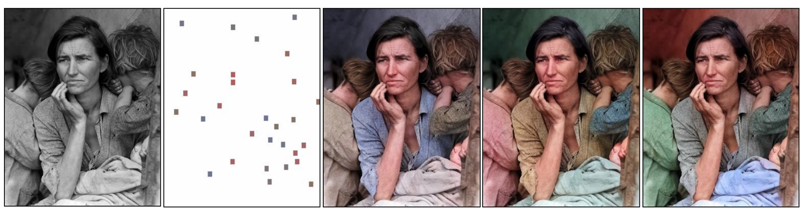
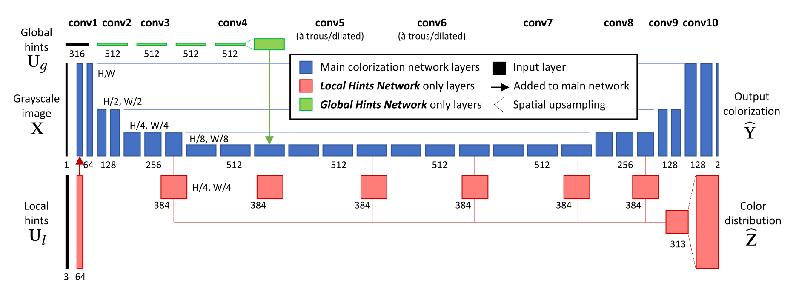
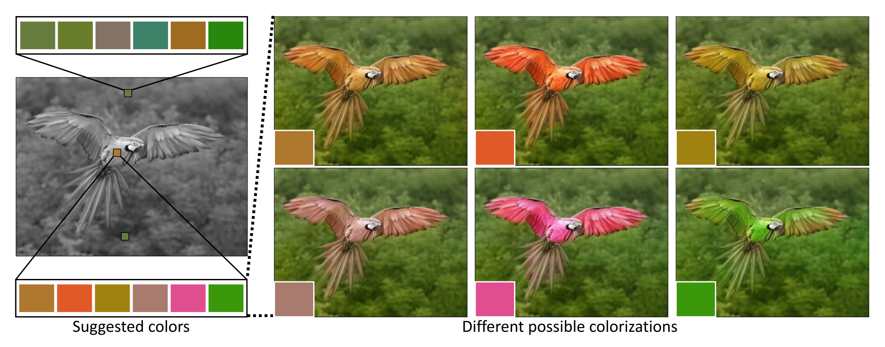
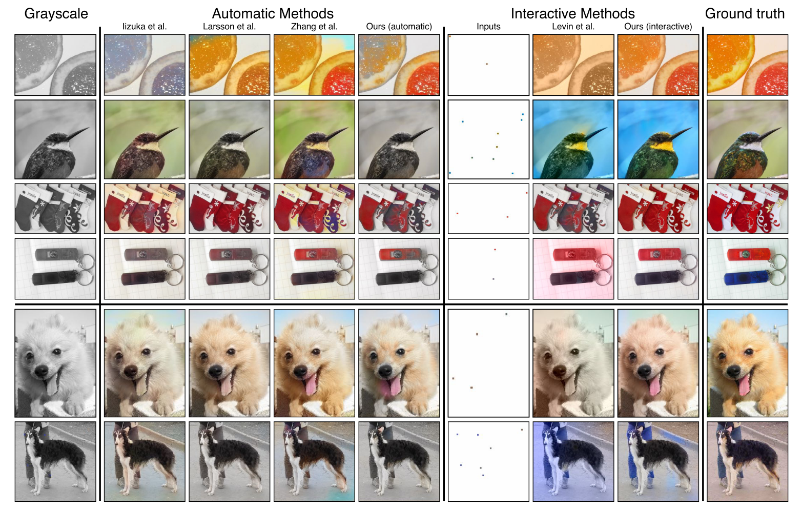
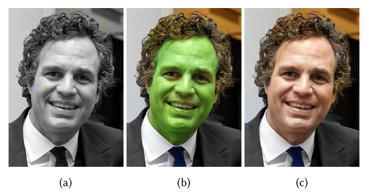
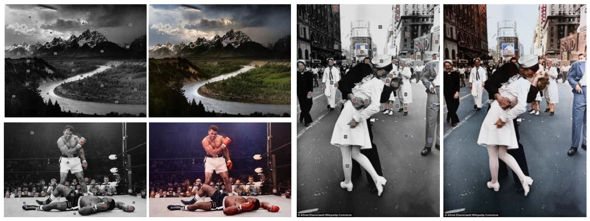

[arxiv](https://arxiv.org/abs/1705.02999), [github(official)](https://github.com/junyanz/interactive-deep-colorization), [project](https://richzhang.github.io/InteractiveColorization/)

## どんなもの？

ピクセルレベルの色ヒントであるlocal hintsと、画像全体の色ヒントであるglobal hintとを組み込んだインタラクティブな着色手法を提案。インタラクティブな着色を可能にしました。

## 先行研究と比べてどこがすごい？

local hintsを組み込むことで、インタラクティブな着色を可能にしました。より自然で鮮やかな着色が可能になりました。

## 技術や手法のキモはどこにある？

### 着色とは？

まずは着色タスクにおける入出力を確認しておきましょう。

入力は $\mathbf{X} \in \mathbb{R}^{H \times W \times 1}$ のグレースケール画像です。ここで、画像の高さが $H$, 幅が $W$ を表します。グレースケール画像とは、Lab 色空間の L 成分であり、明度を意味します。Lab色空間については [Lab色空間 -wikipedia-](https://ja.wikipedia.org/wiki/Lab%E8%89%B2%E7%A9%BA%E9%96%93#:~:text=Lab%E8%89%B2%E7%A9%BA%E9%96%93%EF%BC%88%E3%82%A8%E3%83%AB%E3%83%BB%E3%82%A8%E3%83%BC,%E3%82%82%E3%81%AE%E3%81%AB%E5%9F%BA%E3%81%A5%E3%81%84%E3%81%A6%E3%81%84%E3%82%8B%E3%80%82) を参照してください。

出力は  $\mathbf{\hat{Y}} \in \mathbb{R}^{H \times W \times 2}$ の画像です。Lab色空間の a\* 座標 と b\* 座標とを予測します。なぜ出力が2次元かというと、入力が L\* 座標であるため、最終的に a\* と b\* を加算すれば Lab 画像（カラー画像）が表現できるためです。

### Network Architecture

ネットワークは3つの構成から成ります。

- **Main Colorization Network**｜L\* のグレースケール画像から a\* b\* 画像を予測するネットワーク
- **Local Hints Network**｜ユーザのローカルな色ヒントを加えるネットワーク
- **Global Hints Network**｜画像全体の色ヒントを加えるネットワーク

### Main Colorization Network

L\* 画像 $\mathbf{X}$ から a\* b\* 画像 $\mathbf{\hat{Y}}$ を出力するネットワークです。skip connection を有する U-Net（Ronneberger et al. 2015）型の CNN を採用しています。

構造の詳細は [official github](https://github.com/junyanz/interactive-deep-colorization/blob/master/models/pytorch/model.py) を参照してください。

### Local Hints Network

本ネットワークは主に２つの役割があります。
- ユーザが指定したローカルな色ヒント local hints を、グレースケール画像に組み込みます
- ユーザにおすすめカラーパレットを提示できるように学習します

1つ目は concat するだけなので省略し、2つ目の役割について以下で説明します。

#### Data-drive color palette

もっともらしい色を選ぶことは、現実的な色付けに向けた重要なステップです。適切なツールがないと、ユーザーが直感的に色を選択するのが難しい場合があります。

すべてのピクセルについて、出力色 $\mathbf{Z} \in \mathcal{R}^{H \times W \times Q}$ の確率色分布（color distribution）を予測します。ここで、Qは量子化された色のビンの数であり、$Q=313$ を指定しています。

color distribution $\mathbf{\hat{Z}}$ を予測するために、$\psi_l$ によってパラメーター化されたネットワーク $\mathcal{G}_l$ を用いて、入力グレースケール画像 $\mathbf{X}$ と local hints によるマッピングを学習します。ground truth 分布 $\mathbf{Z}$ は、ground truth colors $\mathbf{Y}$ からエンコードされます。全ピクセルに対し、cross-entropy loss を計算します。

$$
\mathcal{L_{cl}(\mathcal{G}_l(\mathbf{X}, \mathbf{U}_l; \psi_l), \mathbf{Z})} = \sum_{h,w} \sum_q \mathbf{Z}_{h, w, q} \log (\mathcal{G}_l (\mathbf{X}, \mathbf{U}_l; \psi_l)_{h, w, q})
$$

$$
\psi_l^* = \arg \min_{\psi_l} \mathbb{E}_{\mathbf{X}, \mathbf{Y} \sim D} [\mathcal{L_{cl}(\mathcal{G}_l(\mathbf{X}, \mathbf{U}_l; \psi_l), \mathbf{Y})}]
$$

### Global Hints Network

*Global Hintsによる着色の例。各画像右上の画像が Global Hints として与えられている。*

Global Hints には空間情報がないため、Main Colorization Network の中央付近に情報を concat します。

## どうやって有効だと検証した？

### 定量評価

評価指標は PSNR です。PSNRについては [画質指標PSNRを求める](http://who7s.blog.shinobi.jp/%E3%83%97%E3%83%AD%E3%82%B0%E3%83%A9%E3%83%9F%E3%83%B3%E3%82%B0/%E7%94%BB%E8%B3%AA%E6%8C%87%E6%A8%99psnr%E3%82%92%E6%B1%82%E3%82%81%E3%82%8B) を参照してください。

### 定性評価

インタラクティブな機構を導入することで、従来手法より鮮やかに、自然な着色が行えています。

## 議論はあるか？

### ユーザが普通はありえない色に塗ったら？

ヒトの顔を緑で塗ったとしても、その通りの着色結果が得られます。

*(a) 意図しない local hints の入力。(b) 図(a)による着色結果。(c) 適切な肌色による着色結果。*

### 古い白黒写真にも適用してみた

古い白黒写真にもある程度有効に働くようです。しかし古い写真には折れ、破れなどがあるため、あくまで着色のみ行えるようです。

*入力の local hints がかなりたくさん必要。使いこなすの大変そう。*

## 次に読むべき論文はあるか？

- [Jehng-Wei Su et al., "Instance-aware Image Colorization," CVPR 2020](/paper-summary/2020-instance-aware-image-colorization/)
  - 本研究をベースにしている
  - Object Detection + Colorization で高精度な着色を実現