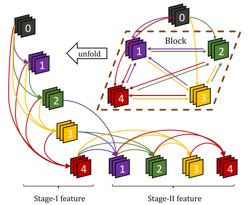
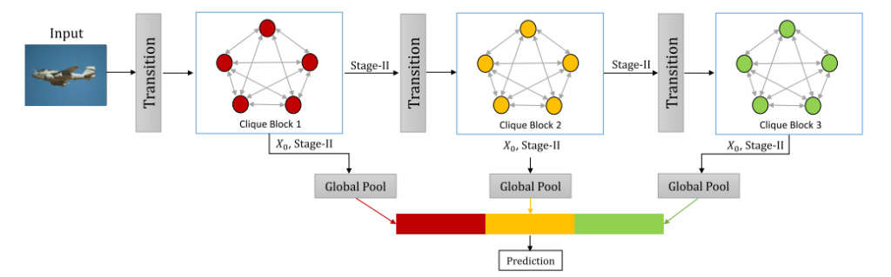
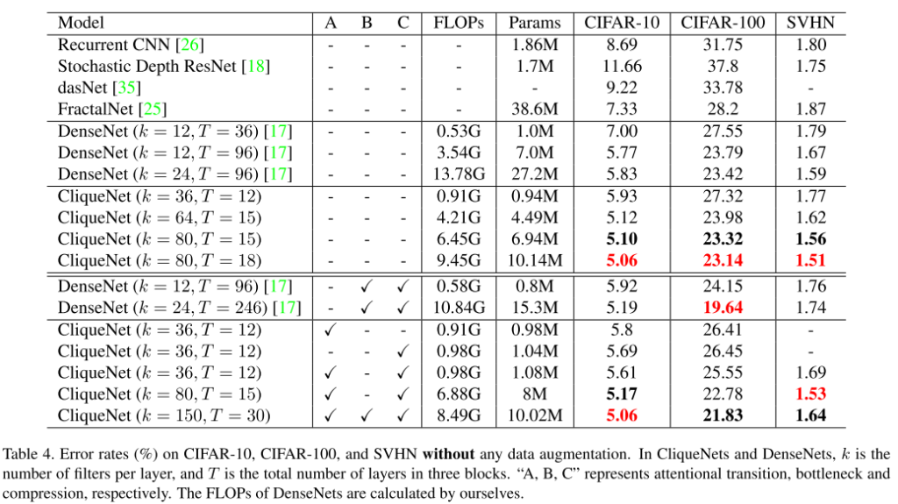

[Arxiv](https://arxiv.org/abs/1802.10419), [GitHub(unofficial)](https://github.com/iboing/CliqueNet)

## どんなもの？

DNNにおいて情報の流れ（information flow）を改善し、学習の安定性を向上させ、パラメータの効率化を図ったCliqueNetを提唱しました。

## 先行研究と比べてどこがすごい？

既存ネットワーク（VGGなど）はforward/backwardが決まった2層間で行われており、勾配消失やパラメータ数の増加の問題がありました。本提案では、同ブロックの任意のレイヤー間でforward/backwardする **CliqueNet** を提唱しました（RNN+Attention = CliqueNet）。

## 技術や手法のキモはどこにある？

### Clique Block

-   従来のネットワークとは異なり、同ブロック内の任意の２つの層の間には順方向接続と逆方向接続の両方があります。
-   層はループとして構成され、交互に更新します。
-   各層では、同じブロック内の他の層の入力と出力の両方であるため、層間の情報の流れは最大化されます。
-   伝播中に新しく更新された層は、前に更新されたレイヤを再更新するために連結され、パラメータは複数回再利用されます。
-   Recurrent Feedback構造は、低レベルのフィルタを洗練し空間的注意を払うため、より高いレベルの視覚情報を取り戻せます。

### Multi-scale Feature Strategy 

-   各Clique Blockを連結し、間にTransitionブロック（畳み込みやプーリング）を挟みます。
-   Stage Iはすべての層を初期化
-   Stage IIはAttentionの機能のおかげで高度な視覚情報を取り入れられます（？？？）
-   各ブロックの出力をGlobal Poolingしたのち、lossを求めます

## どうやって有効だと検証した？

-   CIFAR-10, CIFAR-100, SVHN, ImageNetデータセットを利用しました。
-   従来ネットワークよりパラメータ数やエラー率が低下しました。

## 議論はあるか？

従来のネットワークとは異なり、本提案はより深い表現空間を達成するために固定数のパラメータを利用し、注意メカニズムを達成するために回帰フィードバックを組み込んでいます。本提案のトポロジーによりsemantic segmentation, object detection, image captioningなど、新しいコンピュータビジョン用のモデルを開発できる可能性があります。

層は交互に更新されるため、層は互いに監視されます。また、Stage IIでは、特徴マップは常にフィルタの更新情報が最新のものになるようにし、より高いレベルの情報を受け取ります。この空間的アテンションメカニズムは、層を繰り返し洗練させ、画像のノイズや背景を抑制し、ターゲットオブジェクトを特徴付ける領域により多くの活性化を集中させられます（いらない情報をそぎ落としていくイメージ？？？）。

## 次に読むべき論文はあるか？