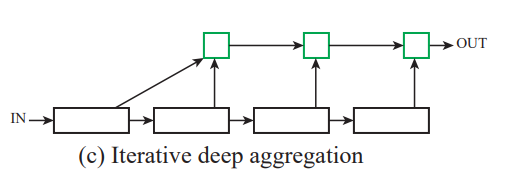
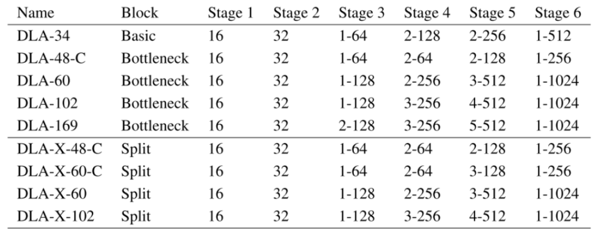

[arxiv](https://arxiv.org/abs/1707.06484), [github](https://github.com/ucbdrive/dla), [解説記事（英語）](https://medium.com/@mikeliao/deep-layer-aggregation-combining-layers-in-nn-architectures-2744d29cab8)

## どんなもの？

物体位置認識の精度向上のために、従来より「深い」skip connectionを導入したネットワーク構造 **Deep Layer Aggregation** を提案しました。ResNet/ResNext/DenseNetよりも、メモリ使用量とパフォーマンスが向上しました。

## 先行研究と比べてどこがすごい？

従来手法である、ResNet, DenseNet, U-Net等はskip connectionを利用していました。skip connectionのメリットとして、

-   CNN前半の低レベル特徴と、CNN後半の高レベル特徴を組み合わせて精度向上を見込める
-   勾配を伝えやすくするため勾配消失問題に対処し、より深いネットワークを学習可能になる
-   down-samplingした後に、詳細な空間情報の再現に使える（例：U-Netのsemantic segmentation）
-   収束時間の低減

がありました。しかし、従来手法のskip connectionは下図(b)に示すように「浅い」結合しか適用されていませんでした。本提案では、より「深い」結合をネットワークに取り入れ、少ないパラメータ数かつ高精度なネットワーク構造 Deep Layer Aggression を提唱しました（下図(c) ~ (f)）。

## 技術や手法のキモはどこにある？

Deep Layer Aggregationは、**Iterative Deep Aggregation（IDA）** と **Hierarchical Deep Aggregation（HDA）** から成っています。それぞれの役割をまとめると、以下のようになります。

-   Deep Layer Aggregation：ネットワークから意味的/空間的情報の全部分を適切に抽出する（うまく画像分類できるように上手に特徴量を抽出したい）
-   Iterative Deep Aggregation：隣接するステージを結合して、表現を徐々に深め、空間的に洗練（物体の大きさ、解像度等に依存しない情報を抽出していきたい）
-   Hierarchical Deep Aggregation：特徴量と勾配をより適切に伝播する

Deep Layer AggregationHDAとIDAを繰り返していきます。

### Iterative Deep Aggregation（IDA）

IDAは解像度とスケールの融合にフォーカスを置いています。IDAでの集計は反復的であり、最小スケールから始まり、より深く大きなスケールを繰り返しマージ・圧縮していきます。

### Hierarchical Deep Aggregation（HDA）

HDAは、すべてのモジュールとチャネルの機能のマージに重点を置いています。層を順次結合するIDAとは異なり、HDAの構造はツリーのような構造でより多くの機能階層にまたがる層を結合します。 緑色のAggregation Nodeの出力が、次のブロックの入力にどのようにフィードされるかに注意してください。これにより、前のレイヤーの機能が保持されます。

## どうやって有効だと検証した？

### 実験設定

-   多数のトポロジの提案モデル（DLA; Deep Layer Aggregation）を用意

### 定量評価（パラメータ数）

-   軽量化モデルであるSqueezeNetと比較しても、提案モデル（DLA）のCompactモデルは少パラメータ数で認識性能もよい。

### 定量評価（エラー率）

-   ILSVRC datasetでの先行研究との比較結果
-   従来手法とエラー率を比較しても良い結果

DLA/DLA-Xが提案手法です。

## 議論はあるか？

-   skip connectionが”shallow”という部分の論理がよくわからなかった。

## 次に読むべき論文はあるか？

-   U-Net: Convolutional Networks for Biomedical Image Segmentation
    -   かの有名なpix2pixにも強い影響を与えた重要な論文

## コメント

ずっと aggression（侵略） だと思って読んでいました。「侵略要素ねーじゃん！」と一人でツッコんでいました。