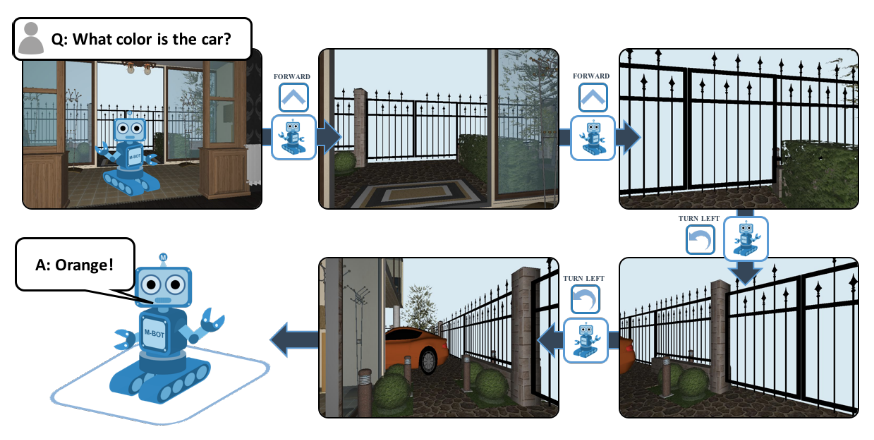
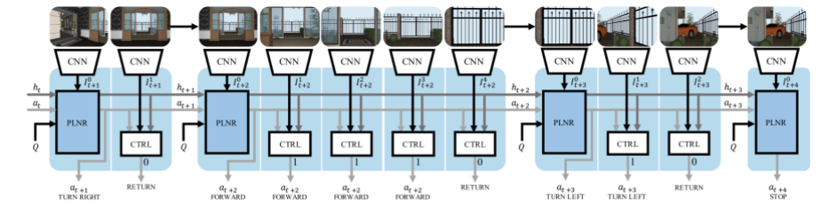
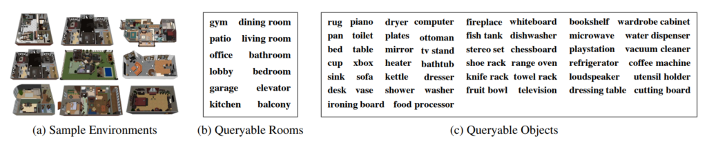
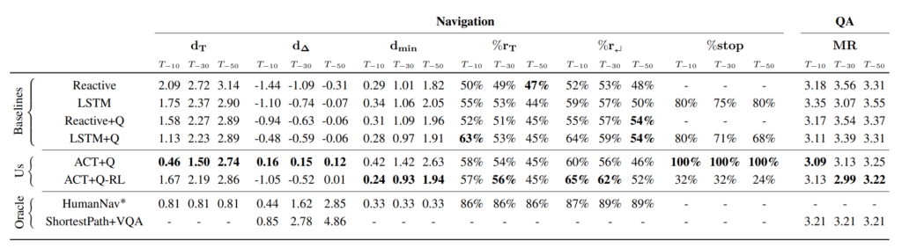

[Paper Link](https://arxiv.org/abs/1711.11543), [Project Page](https://embodiedqa.org/), [YouTube](https://www.youtube.com/watch?v=gVj-TeIJfrk)

## どんなもの？

ロボットが環境内を動き回りながら探索し、質問に対する答えの文を生成する **Embodied QA** というタスクを提唱しました。強化学習ベースのend-to-endな手法でEQAロボットを学習させました。

## 先行研究と比べてどこがすごい？

賢いagentsには、環境（五感情報）を知覚し、情報をやりとりし、行動できることが将来的に求められています（ドラえもんへの第一歩）。その目標への一歩として、Embodied Question Answeringタスクを新たに提案しました。Embodied QA達成には主体的な動作、言語理解、目標への移動、一般常識の保有（「車はガレージにあるだろう」）、言語を動作に落とし込むなど、広いAIタスクを解く必要がある難度の高いタスクです。

1.  AIは環境内のランダムな位置にスポーン
2.  質問を受ける（ex. 車は何色？）
3.  環境内を一人称視点で動き回り、質問に対する答えを探る
4.  質問に対する答えの文を生成

本研究では、Embodied QAを達成するロボットの作成手法も提案しました。ロボットが環境内を動き回りながら探索し、質問に対する答えの文を生成します。

## 技術や手法のキモはどこにある？

-   Adaptive Computation Time navigatorという強化学習ベースでのend-to-endな手法を提案
-   タスク処理を計画と制御の２つのモデルに分解

## どうやって有効だと検証した？

SUNCG datasetという住宅3D仮想環境で実験しました。

質問の正答率、移動の正確性において従来より高いスコアを誇りました（EQA用に最適化されていないアルゴリズムなので、優位性を主張するのはアンフェアな気はしますが）。

## 議論はあるか？

-   Amazonさんとか、大きい倉庫を持っている企業は喜びそう
-   マップやオブジェクト情報が既知という前提があるため、完全に未知の領域には応用できないおそれ

## 次に読むべき論文はあるか？

EQAの系列の論文です。

-   [A. Das et al., “Neural Modular Control for Embodied Question Answering, ” CoRL 2018](https://arxiv.org/abs/1810.11181)
-   [L. Yu et al., “Multi-Target Embodied Question Answering, ” CVPR 2019](https://arxiv.org/abs/1904.04686)
-   [E. Wijmans et al., “Embodied Question Answering in Photorealistic Environments with Point Cloud Perception, ” CVPR 2019](https://arxiv.org/abs/1904.03461)