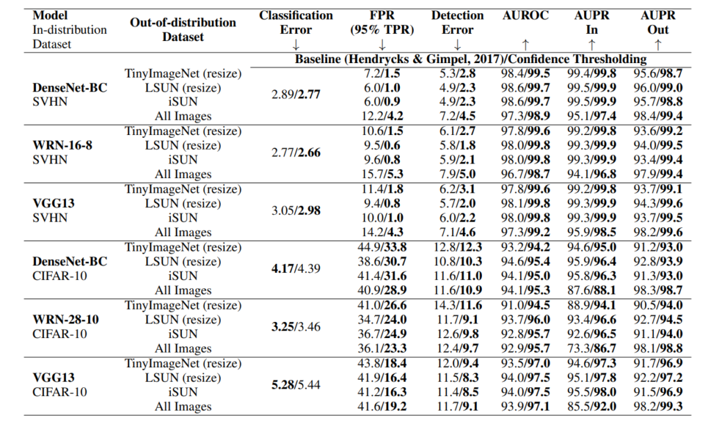

[arxiv](https://arxiv.org/abs/1802.04865), [github](https://github.com/uoguelph-mlrg/confidence_estimation), [解説記事（日本語）](http://ninhydrin.hatenablog.com/entry/2018/12/26/002516)

## どんなもの？

softmaxの出力ベクトルpとともに、確信度スカラーcを別途出力する手法の提案。モデルの想定外データに対し、予測の確信度が低いことを伝えられます。

## 先行研究と比べてどこがすごい？

-   出力層の最後にcとlossを加えるだけのため、既存のモデルに追加しやすいです。
-   実システム上で確信度cが低い出力は人が確認する等の分岐処理が入れられるようになります。モデル判断のグレーゾーンがわかります。

## 技術や手法のキモはどこにある？

まず確認しておきたいことは、「softmax の出力 ≠ 予測確率」です。softmax は出力の総和が1になるように正規化してくれているから確率として解釈できるだけであって、確率そのものではありません。

### Model Architecture


モデルの最後を拡張し、確信度 $c \in [0, 1]$ も同時に出力するようにするだけです（softmaxをかませます）。例えば、画像認識の多クラス分類では、

$$
p = f(x; \theta)
$$

$$
\sum_i p_i = 1, p_i \geq 0
$$

という問題設定を

$$
(p, c) = f(x; \theta)
$$

にしただけですね。モデル内部に影響を与えないため、既存手法の拡張性/親和性で優れていると言えます。

### Objective Function

分類タスクでおなじみのCross-entropy Loss $\mathcal{L_t}$ と、Penalty Loss $\mathcal{L_c}$ の２つを考慮します。

$$
\mathcal{L} = \mathcal{L_t} + \lambda \mathcal{L_c}
$$

$\lambda$ は調整用のパラメータであり、学習中に逐一調整を行います。具体的には、以下の処理を行います。ここで $\beta$ はハイパラであり、$\beta \in [0,1]$ です。

```python
beta = 0.3
if loss_c > beta:
  increase lambda  # make it more expensive to ask for hints
else:
  decrease lambda  # make it more affordable to ask for hints
```

### Cross-entropy Loss

分類タスクでよく使われる loss です。$p'_i$ はクラス予測 $p_i$ と確信度 $c$ の計算結果であり、確信度考慮済みの出力結果です。通常の教師あり学習は $c=1$ に相当します。

$$
\mathcal{L_t} = - \sum_{i=1}^M \log (p'_i)y_i
$$

$$
p'_i = c p_i + (1-c)y_i
$$

### Penalty Loss

本研究で新たに提唱された loss です。上記 Cross-entropy loss のみですと、**確信度 $c$ が低いほどラベル $y$ の情報量が増え、予測精度 $p'$ が不当に向上できてしまいます。** 確信度 $c=0$ とするだけで常に正解ラベルを参照でき、Cross-entropy loss をゼロにできてしまいます。「全部わからないから全部答え教えてください！」といってもペナルティがないのです。

そこで、確信度 $c$ にペナルティ項を加えました。ヒントを受け取ると答えやすくなりますが、ヒント料を払わないといけないイメージです。

$$
\mathcal{L_c} = -\log(c)
$$

## どうやって有効だと検証した？

学習用データセットとして SVHN/CIFAR-10 を用いました。分布外データセットとして、TinyImageNet, LSUN, iSUN を用いて out-of-distribution detection を行いました。評価指標は FPR/DetectionError/AUROC/AUPR です。表内の矢印の向きが評価指標の良さの向きを表しています。

ほぼすべてのベースモデルとデータセットにおいて、本手法は有効に働いていることがわかります。



## 議論はあるか？


## 次に読むべき論文はあるか？