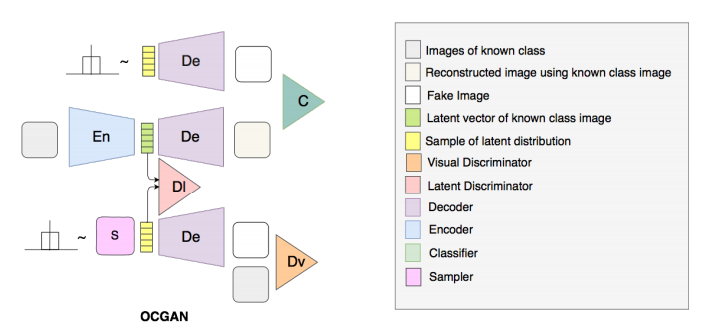
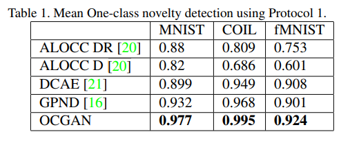

[arxiv](https://arxiv.org/abs/1903.08550), [github](https://github.com/PramuPerera/OCGAN)

## どんなもの？

Denoising Autoencoder＋GANでワンクラス分類を行うために、排他的な潜在表現を学習するような制約を提案しました。提案手法（下段）の方が、普通のAutoencoder（中段）より上手に再構成できており、入力画像と再構成画像との差分（MSE）を大きく取れています。

## 先行研究と比べてどこがすごい？

train dataから得られた潜在空間を全探索するというネットワーク構造 **Latent Discriminator**, **Visual Discriminator**, **Informative-negative Mining** を提唱しました。

## 技術や手法のキモはどこにある？

### Overview

OCGANは4つのサブネットワークから構成されます。

-   Denoising Autoencoder
-   Latent Discriminator
-   Visual Discriminator
-   Informative-negative Mining

### Denoising Autoencoder

いつものやつです。入力画像を再構成できるように潜在空間への写像を学習します。

本研究では、Denoising Autoencoder（DAE）を採用しています（なぜ？）。入力画像に対し、$\mathcal{N}(0, 0.2)$ のホワイトノイズを加えた画像を再構成します。また、出力の飽和を防ぐために（潜在空間が有界になるように）、最終層はtanhを使用しています。

lossは以下の式で表され、いたって普通のMSEです。$n$ はノイズを表します。
$$
l_{MSE} = ||x-De(En(x+n))||^2_2
$$
### Latent Discriminator

**Latent Discriminator** では、潜在空間上の全サンプルから、所定クラス画像を生成できるような潜在空間の構築を目指します。そのために、「train dataのlatent space」と「fake input」とを見分けるDiscriminatorを導入しました。

fake inputには、d次元の一様分布 $U(-1, 1)^d$ からランダムサンプリングしました。一様分布というのがミソであり、隅々まで均等に分布するような潜在表現のマッピングをエンコーダが学習するようになることが期待できます。

lossは以下の式です。こちらもGAN系でおなじみのlossですね。

$$
l_{latent} = -(\mathbb{E}_{s \sim \mathbb{U}(-1, 1)}[\log D_l(s)] + \mathbb{E}_{x \sim p_x}[1-D_l(En(x+n))])
$$
### Visual Discriminator

Latent DiscriminatorがEncoderの敵対的学習ならば、Visual DiscriminatorはDecoderの敵対的学習です。

与えたクラス以外のサンプルを生成しないように、「train data」と「Generatorによってランダム生成された画像」とを区別するためのVisual Discriminatorを導入しました。

$$
l_{visual} = -(\mathbb{E}_{s \sim \mathbb{U}(-1, 1)}[\log D_v(De(s))] + \mathbb{E}_{x \sim p_l}[1-D_v(x)])
$$

### Informative-negative Mining

Informative-negative sampleとは、与えたクラスの画像を再構成できていないサンプルと定義します（9を再構成するはずが、0のような画像になってしまったり）。これらInformative-negative sampleを効率よく検出する識別機 Classifier を導入した。生成後の画像がどのクラスに当てはまるのかを学習する。

### 疑似コード

## どうやって有効だと検証した？

### 実験①

-   train data：正常クラスの80%
-   test data：正常クラスの20% ＋ 異常クラスの各50%

提案手法がいずれも最も高いAUCを達成。

### 実験②

-   train data：正常クラスのtrain data全部
-   test data：全クラスの test data

## 議論はあるか？

アイディアは非常に面白いですし、手が凝っていますが、その割に結果がビミョーですね。

MNISTのような補正済みのシンプルなデータセットには有効ですが、CIFAR10のような多種多様なデータ、ないしは現実の不良品データにはまだまだ発展途上だと思います（実データは論文中で試してはいませんが）。~~普通にVAEに劣っているときもありますし…。~~

ラベル付与済みデータが限られている環境では有効に働くのでは？という疑問。提案しているClassifierの構造上、どのようなラベルが来るのかわからない環境では不適切かと思います。

## 次に読むべき論文はあるか？

-   [Thomas Schlegl, et al., "Unsupervised Anomaly Detection with Generative Adversarial Networks to Guide Marker Discovery, " IPMI 2017](https://arxiv.org/abs/1703.05921)
    -   AnoGAN。同じGANを用いた異常検知手法。
-   [[2020] Anomaly Detection by Latent Regularized Dual Adversarial Networks](/paper-summary/2020-anomaly-detection-by-latent-regularized-dual-adversarial-networks/)
    -   分布外検知におけるGANベースの異常検知手法です。本手法の上位互換。

