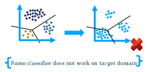
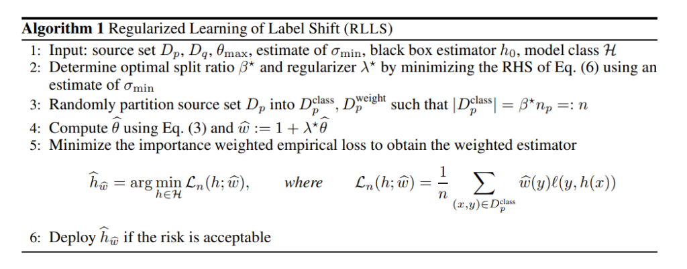
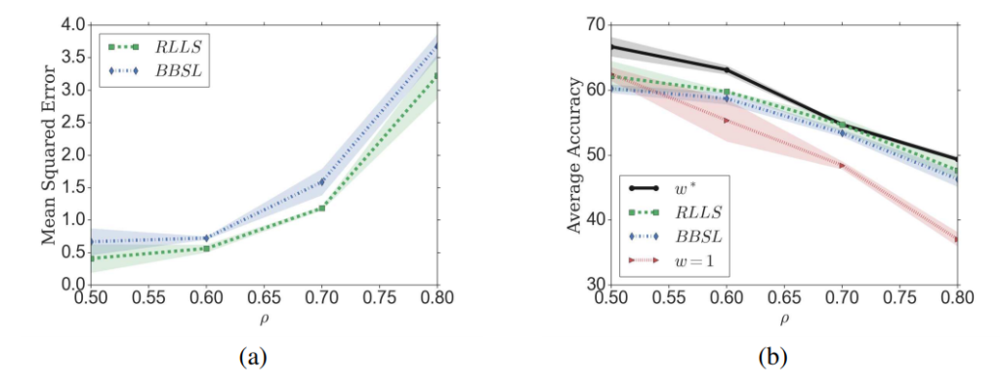

[arxiv](http://arxiv.org/abs/1903.09734), [poster](https://s3.amazonaws.com/postersession.ai/7b41ab87-b444-4d6a-bf6a-c50c36f90d28.pdf), [github(official)](https://github.com/Angie-Liu/labelshift)

## どんなもの？

ソースドメインで分類器を学習するとき、どのクラスを優先すれば、ターゲットドメインで最高のパフォーマンスを出せるかを調査しました。ソースドメインPとターゲットドメインQとで、クラスごとのサンプル割合が異なる条件を想定しています。

## 批判されている理論は何？

ソースドメイン（以下、$P$）は $n$ 個の入力データ $x$ とラベルデータ $y$ 、ターゲットドメイン（以下、$Q$）は $m$ 個の入力データ $x$ からなるとします。なお、$P$ と $Q$ は $i.i.d.$ とします。

$$
P = (\{x_i, y_i\}_{i=1}^n)
$$

$$
Q = (\{x_i\}_{i=1}^m)
$$

転移学習手法の一つとして **Covariate Shift（共変量シフト）** があります。ソースドメインとターゲットドメインの確率分布が異なる状況で、入出力関係が（ほぼ）等しいモデルを選ぶ手法です。

$$
p(x) \neq q(x), p(y|x) = q(y|x)
$$

しかし、Convariate Shift では、$P$ ではうまく機能しましたが、$Q$ では機能しない可能性があります。$P$ と $Q$ ではドメインが異なるため、分類境界（$y$ の領域）も異なる場合が多いためです。

## どういう論理展開？

新たに **Label Shift** を提案しました。アイディアとしては単純で、Convariate Shiftと $x$ と $y$ を入れ替えました。

$$
p(y) \neq q(y),  p(x|y) = q(x|y)
$$

計算量的にも Convariate Shift より抑えられるというメリットがあります。一般的にラベルの次元は入力の次元より遥かに小さい次元であるためです。

しかし、ラベルデータは $P$ にしかなく（$Q$ のラベルデータは不明）、適切な重み配分は不明です。そこで、**RLLS; Regularized Learning under Label Shifts** というLabel Shiftを採用した学習方法も提案しました。$P$ のデータが既知であり、$P$ のクラスのサンプル数で重みづけをすれば、$Q$ におけるlossも推定可能というアイディアですね（あくまで推定である点に注意）。

## どうやって有効性を検証した？

-   （左図）提案手法RLLSで導出した重みの方が、先行研究BBSLより理想的な重みより誤差が低いです。
    -   横軸：label shiftの度合い（分割割合）、縦軸：理想的な重みとのMSE
    -   理想的な重みは、$P$, $Q$ において全サンプル既知として求めました
    -   BBSLでは許可されていない、特に少量のサンプルレジームに対して、より堅牢な重要度の重み推定量と一般化の保証につながります。
-   （右図）Cifar-10の識別性能も、先行研究より良い

## 議論はある？

アイディアは単純で計算量も確かに抑えられますが、実用性に関しては未だ発展途上という印象を受けました。

ラベルシフトの仮定自体が、現実の世界では単純すぎる可能性があるのではと思います？実際の入力は、必要なラベルだけでは説明できないことが多いです。症状（入力）から病気（ラベル）の推定は可能ですが、逆は絞り切れません。また、入力にない第３の要因（生活条件や人口密度等）も関係しているかもしれません。

また、最終的な予測結果（正解率等）が、先行研究より優れているからと言って、現実データのシフトに対して堅牢であるかまでは不明なままです。

## 次に読むべき論文は？