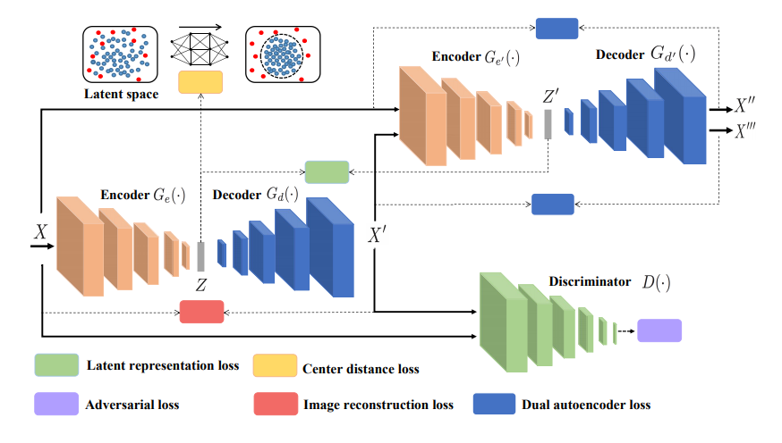
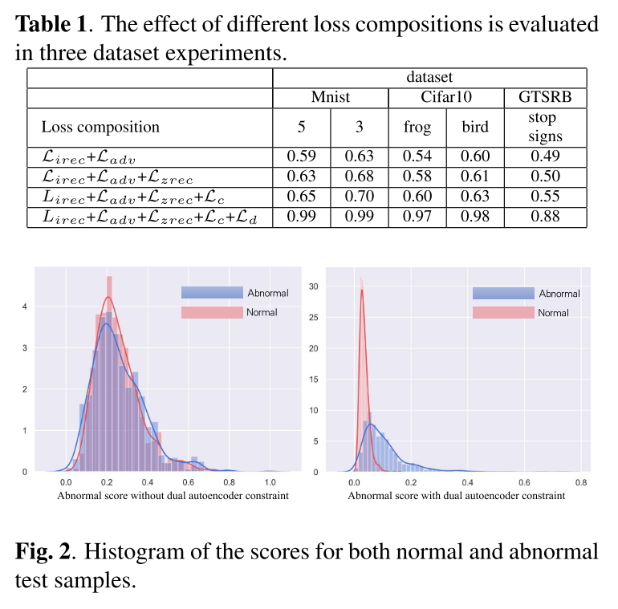
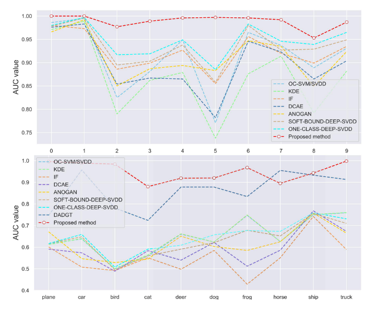

[arxiv](https://arxiv.org/abs/2002.01607)

## どんなもの？

分布外検知におけるGANベースの異常検知手法です。AE型のGeneratorを2つ、Discriminatorを1つ組み合わせたアーキテクチャで安定性を確保しました。CIFAR-10においてAUC 0.9以上を達成しました（SOTA）。

## 先行研究と比べてどこがすごい？

-   CIFAR-10において、AUC0.9以上を達成
    -   他手法の追随を許さない圧倒的精度
-   2つのAEを用いることによる、**Dual Autoencoder Lossの**概念を提唱（後述）

## 技術や手法のキモはどこにある？

### Network Architecture

### Loss Function

全体のlossは以下のようになります。5つのlossを組み合わせています。

$$
\mathcal{L} = w_i \mathcal{L_{irec}} + w_a \mathcal{L}_{adv} + w_z \mathcal{L}_{zrec} + w_c \mathcal{L}_c + w_d \mathcal{L}_{dual}
$$

ここで、$w_*$ は係数です（$w_i = 1, w_a = 5, w_z = 1, w_c = 0.05, w_d = 1$）

#### Image Reconstruction Loss

$$
\mathcal{L_{irec}} = \mathbb{E}_{x \sim p_x} ||x-G(x)||_1
$$

いつものL1ノルムでの reconstructed loss です。

#### Adversarial Loss

$$
\mathcal{L_{adv}} = \min_G \max_D(\mathbb{E}_{\mathbf{x} \sim p_\mathbf{x}}[\log(D(\bf{x}))] + \mathbb{E}_{\mathbf{x} \sim p_\mathbf{x}}[\log(1-D(G(\mathbf{x})))])
$$

これもGAN系ではおなじみですね。特に説明することはありません。

#### Center Distance Loss

$$
\mathcal{L_c} = \min_{\mathcal{W}} \frac{1}{n} \sum_{i=1}^n||\phi(\bf{x}_i; \mathcal{W})-\bf{c}||^2
$$

入力画像 $\bf{x}_i$ をAE1のEncoderで写像し、その潜在変数がある中心 $\bf{c}$ の周りに集まるようにしています。

#### Latent Representation Loss

$$
\mathcal{L_{zrec}} = \mathbb{E}||G_e(x) - G_{e'}(x')||_2
$$
AE1とAE2の潜在変数が近づくようにするL2ノルムです。

#### Dual Autoencoder Loss

$$
\mathcal{L_{girec}} = ||x-D'(x)||_1, 
$$
$$
\mathcal{L}_{direc} = ||G(x) - D'(G(x))||_1, 
$$
$$
\mathcal{L}_{dual} = \mathcal{L}_{girec} - k \mathcal{L}_{direc}.
$$
学習が安定化し、別のクラスとの差別化が進む効果があるようです。入力画像 $x$ はAE2の再構成 $x”$ と近づくように学習する一方、$x’$ はAE2の再構成 $x”’$ から離れるようにしています。 $k$ は係数（$k=0.4$）です。

## どうやって有効だと検証した？

### Lossの組み合わせ

5つのlossのうち、どれが異常検知精度向上に効果が大きいのかを確かめました。Dual Autoencoder Loss ($\mathcal{L}$)を入れることで精度が急激に上昇し、anomaly scoreの分布も分離されました。anomaly scoreは元画像とAE2との再構成誤差のようです（なぜ？）。

### 他手法との比較

MNISTとCIFAR10について、１クラスを正常、残りの9クラスを異常として分布外検知を行いました。他手法と比べて圧倒的に分布外検知が行えています。

## 議論はあるか？

-   複数のNNモデルを組み合わせているので、実世界のデータセット/解像度になったときに安定性がどうなるのかが気になります。
-   Dual Autoencoder Lossを入れるとなぜうまくいったんでしょうか？論文中では述べられていません。

## 次に読むべき論文はあるか？

-   [I. Golan, R. El-Yaniv, “Deep Anomaly Detection Using Geometric Transformations”, NIPS 2018](https://arxiv.org/abs/1805.10917)
    -   本研究が出る前の最も精度が良いであろう研究
-   [[2020] Deep Semi-Supervised Anomaly Detection](/paper-summary/2020-deep-semi-supervised-anomaly-detection/)
    -   小数のtraining data＋多数のunlabeled data＋少数の分布外データを利用して、見たことのない分布外データに対しての汎化能力を高める手法 **DeepSAD** を提案しました。