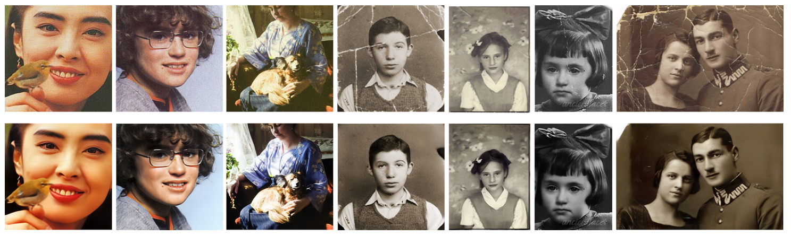
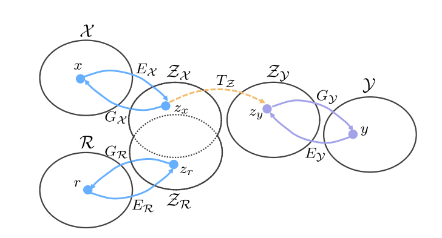
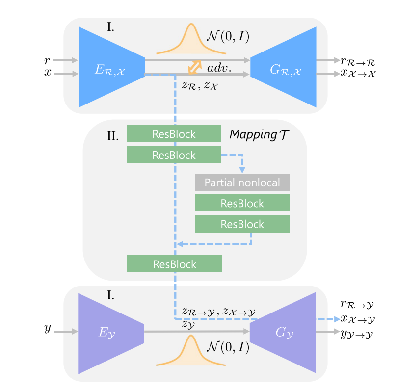
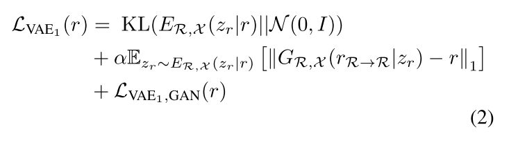
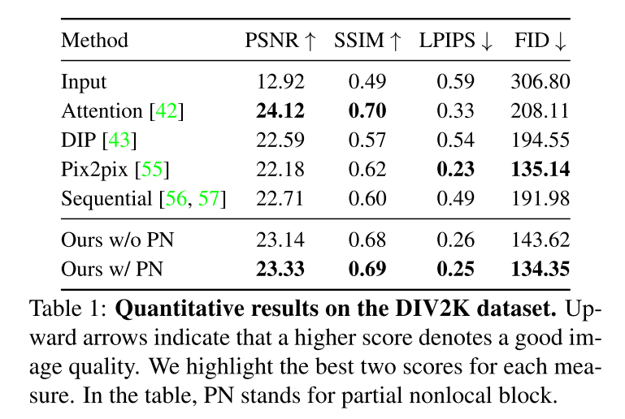
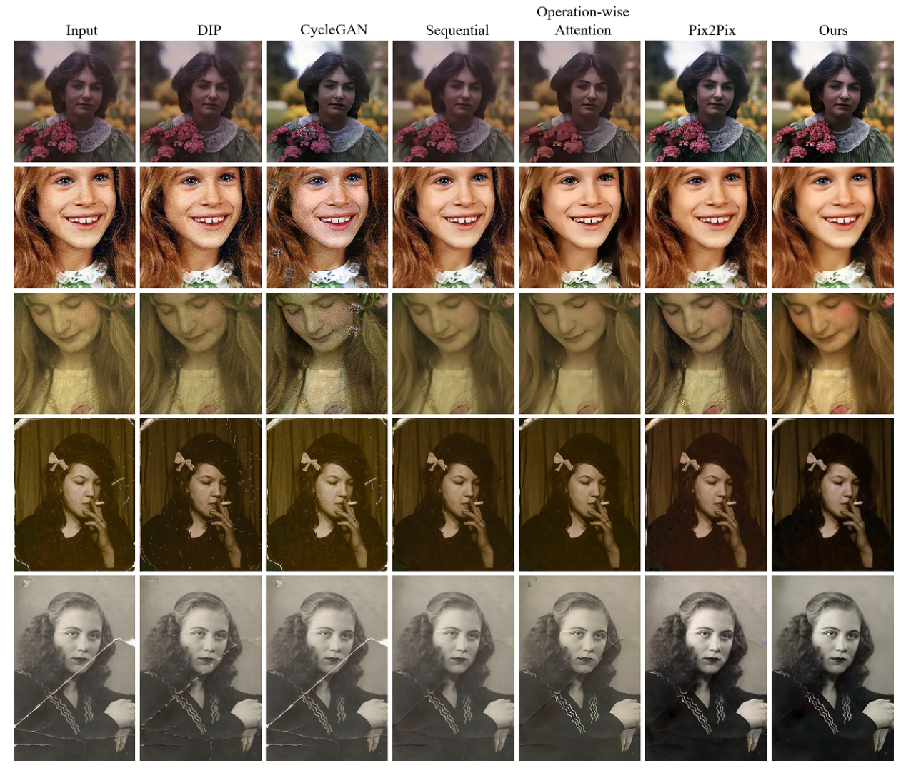
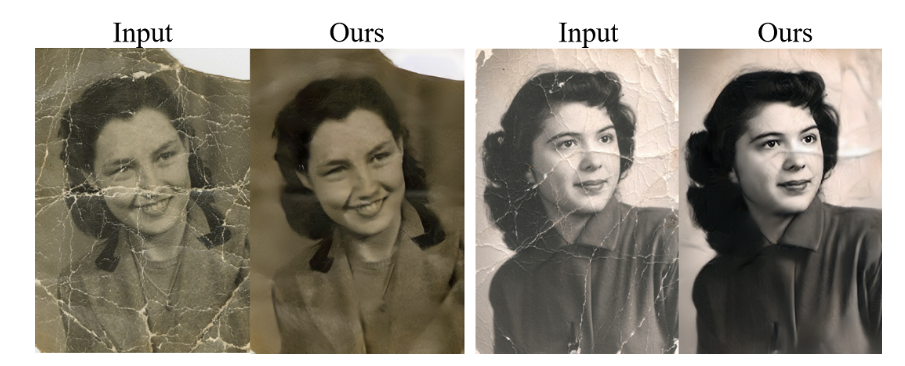

[arxiv](https://arxiv.org/abs/2004.09484), [github(official)](https://github.com/microsoft/Bringing-Old-Photos-Back-to-Life), [project](http://raywzy.com/Old_Photo/)

タイトルが詩的でおしゃれですね。

## どんなもの？

2つのVAEを学習させ、劣化した写真を修復する技術を提案。写真の折れ/傷/よれ/退色等、様々な修復に対応可能です。視覚的品質の面で従来手法よりSOTA. 

*修復結果の例。*

## 先行研究と比べてどこがすごい？

大規模な合成画像のペアと実際の写真とを活用した、**triplet domain translation network** を提案した点。実際の写真の劣化は多種多様であり、合成画像と実際の古い写真との間のドメインギャップにより、ネットワークの一般化に失敗するため。

## 技術や手法のキモはどこにある？

### Old Photo Restoration について

Old Photo Restoration（古い写真修復）というタスクは、合成画像の修復タスクより高難易度です。

1つ目の理由は、**古い写真は多種多様な劣化具合があり、合成画像と古い写真とのドメイン間に隔たりがある** ためです。ネットワークの一般化が困難になり、人工的な折れ/傷のデータセットでは、実際の写真修復は行えません。

2つ目の理由は、**古い写真には複数の劣化が組み合わせっており、各状態に応じた（文脈を考量した）修復が必要になるため** です。フィルムノイズ、ぼやけ、色あせなどの非構造化欠陥は、ローカルパッチ内の周囲のピクセルを利用することにより、空間的に均一なフィルターで復元できます。 一方、引っかき傷や染みなどの構造化された欠陥は、構造的な一貫性を確保するために、グローバルな文脈を考慮して修復する必要があります。

以下では、前述の一般化の問題と混合劣化の問題にそれぞれ対処するためのソリューションを提案します。

### Restoration via latent space translation

本項では一般化の問題に対処します。

写真の復元は画像変換の問題であり、きれいな画像と古い写真とを別個のドメインからの画像として扱い、その間のマッピングを学習したいと考えています。本提案では、従来の2つの異なるドメイン間をブリッジする画像変換方法とは異なり、

- 実際の劣化写真ドメイン $\mathcal{R}$
- 人為的に劣化させた合成画像ドメイン $\mathcal{X}$
- $x \in \mathcal{X}$ に対応する g.t.ドメイン $\mathcal{Y}$（劣化のない画像を含む）

の3つのドメインにわたり画像を変換する **triplet domain translation network** を提唱します。triplet domain translation は、ラベルのない実際の写真と、g.t. に関連する大量の合成データを活用できる利点があります。

3つのドメインからの画像をそれぞれ $r \in \mathcal{R}、x \in \mathcal{X}、y \in \mathcal{Y}$ で表します。ここで、$x$ と $y$ はデータ合成によってペアになります。つまり、$y$ を人為的に劣化させた画像が $x$ です。

一般化の問題により、実際の写真 $\{r\}^N_{i=1}$ からきれいな画像 $\{y\}^N_{i = 1}$ へのマッピングを直接学習できないため、2段階変換を行います。最初に、 

$$
E_\mathcal{R}：\mathcal{R} \mapsto \mathcal{Z}_\mathcal{R}
$$

$$
E_\mathcal{X}: \mathcal{X} \mapsto \mathcal{Z}_\mathcal{X}
$$

$$
E_\mathcal{Y}: \mathcal{Y} \mapsto \mathcal{Z}_\mathcal{Y}
$$

を介して $R, \mathcal{X}, \mathcal{Y}$ を対応する潜在空間にマッピングします。また、合成画像 $\mathcal{X}$ と実際の古い写真 $\mathcal{R}$ はどちらも破損しており、類似した外観を共有していると推測できます。したがって、

$$
Z_\mathcal{R}≈  Z_\mathcal{X}
$$
とみなせます。

次に、潜在空間からの画像復元を学習します。具体的には、合成データペア $\{x、y\}^N_{i = 1}$ を利用することにより、マッピング
$$
T_{\mathcal{Z}}: \mathcal{Z}_{\mathcal{X}} \mapsto \mathcal{Z}_\mathcal{Y}
$$

$$
G_\mathcal{Y} : \mathcal{Z}_\mathcal{Y} \mapsto \mathcal{Y}
$$

を介して、破損した画像の潜在空間 $\mathcal{Z_\mathcal{X}}$ から g.t. 潜在空間 $\mathcal{Z}_\mathcal{Y}$ への変換を学習します。

以上の処理をまとめると、以下の式で表されます。潜在空間上のマッピングを学習することで、古い写真を復元できます。

$$
r_{\mathcal{R} \rightarrow \mathcal{Y}} = G_{\mathcal{Y}} \circ T_{\mathcal{Z}} \circ E_{\mathcal{R}}(r)
$$

#### Restoration Network

$R$ と $X$ が同じ潜在空間にエンコードされているという仮定をしているため、2つのVAE で画像をエンコードすることを提案します（３つではない）。VAE1 と VAE2 との間は Adversarial Discriminator で結ばれます。それぞれ以下の役割があります。

- VAE1（図上部）：$E_\mathcal{R}, E_\mathcal{X}$ を学習します。
- Adversarial Discriminator（図中部）：$T_\mathcal{Z}$ を学習します。
- VAE2（図下部）：$G_\mathcal{Y}$ を学習します。

*上部が再構成を行うVAE1です。中央部は破損画像の潜在空間を、きれいに修復された画像の潜在空間へマッピングする役割があります。下部はきれいに修復された潜在空間から実際の画像へと戻すVAE2です。*

VAE1 では、破損した両方のドメインからの画像を共有潜在空間にマッピングします。敵対的な discriminator を共同でトレーニングすることでドメインギャップを閉じます。 VAE1 の目的関数は以下で定義されます。

ここで、$z_r \in Z_{\mathcal{R}}$ は $r$ の潜在コードであり、$r_{R \rightarrow R}$ は生成出力です。 

- 第1項目｜潜在分布のガウス事前分布からの偏差にペナルティを課す KL-divergence
- 第2項目｜再構成誤差
- 第3項目｜LSGAN でも用いられている least-square loss であり、VAE が過度に平滑化することを防止する役割があります。要は高精細な画像が生成できるようになります。

VAE2は対応する潜在表現 $z_y \in \mathcal{Y}$ を導出できるように、同様の損失で学習します。

### Multiple degradation restoration

本項では混合劣化の問題について対処します。

res-block を使用した潜在的な復元は、各層の受容野が限られているため、局所的な特徴にのみ集中します。しかし、より自然な修復のためには、画像の文脈を考慮して修復する必要があります。そこで、**nonlocal block** という機構を採用しました。nonlocal block は、マスク入力を明示的に利用し、破損領域のピクセルがそれらの領域を完成させるために利用されないようにする機構です。

## どうやって有効だと検証した？

### 定量評価（PSNR/SSIM/LPIPS/FID）

いつもの評価指標です。突出して良い結果はありませんが、先行研究のSOTAレベルをすべての指標で備えた結果が得られています（いいとこ取り?）。

### 定量評価（user selection）

ユーザによる主観評価結果を示します。先行研究より、主観的に良い復元品質であるという結果が得られました。テストセットから25枚の古い写真をランダムに選択し、22人のユーザーが復元品質に応じて結果を並べ替えさせました。

### 定性評価

先行研究より生き生きとした画像が得られているように見えます。こう見ると pix2pix も奮戦している気がします。

## 議論はあるか？

### Limitation

複雑な形状の折れ/傷には対応不可。

## 次に読むべき論文はあるか？

