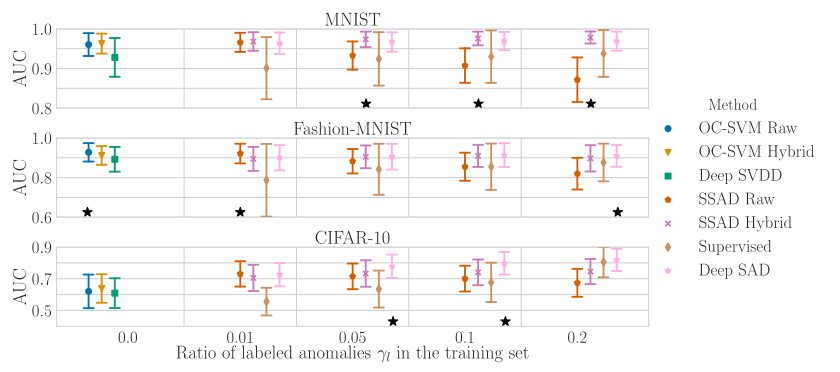
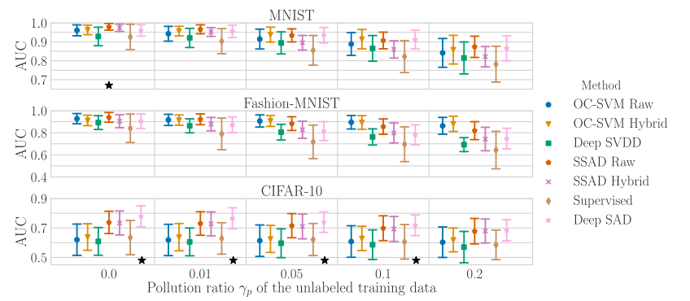
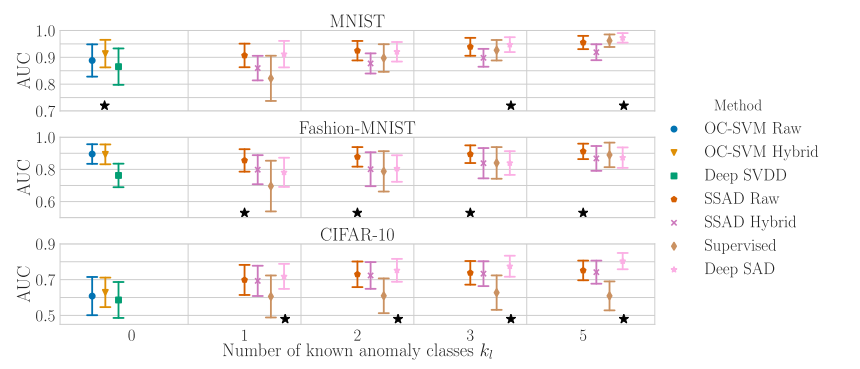

[arxiv](https://arxiv.org/abs/1906.02694), [github(official)](https://github.com/lukasruff/Deep-SAD-PyTorch)

## どんなもの？

小数のtraining data＋多数のunlabeled data＋少数の分布外データを利用して、見たことのない分布外データに対しての汎化能力を高める手法 **DeepSAD** を提案しました。

## 先行研究と比べてどこがすごい？

**分布外検知（OOD; out-of-distribution）** とは、訓練分布と異なるデータを検知するタスクです。本研究と先行研究との相違点を以下に示します。

|             | クラスラベルを利用                                           | クラスラベルを非利用                                         |
| ----------- | ------------------------------------------------------------ | ------------------------------------------------------------ |
| OODを利用   | ・Confidence-calibrated ・ODIN ・Prioe Networks ・Outlier exposure |**Deep SAD（提案手法）**                                    |
| OODを非利用 | ・Learning Confidence ・OOD detection by MCD                 | ・DAGMM ・Geometric ・Deep SVDD ・OCGAN ・Multiple-Hypotheses ・Liklihood Ratios |

分布外のサンプルはそれぞれ異なる分布、つまりエントロピーが高くなるという正則化を利用して学習しました。

## 技術や手法のキモはどこにある？

### エントロピー最大化

分布内データはエントロピーを最小化するように学習しています。逆に、分布外データはエントロピーを最大化するように学習したらいいのではというアイディアです。そのため、全体の objective function は以下で定義されます。

$$
\max_{p(z|x)} \mathcal{I}(\bf{X}; \bf{Z}) + \beta (\mathcal{H}\bf{Z}^- - \mathcal{H}(\bf{Z}^+))
$$

ここで、$\mathcal{I}(\cdot)$ は相互情報量、$\beta(\cdot)$ は分布外データのエントロピー、$\mathcal{H}(\cdot)$ は分布内データのエントロピーを表します。$\max(\cdot)$  がポイントです。

### Object Detection

上記 objective function を object detection に落としたのが以下の式です。

$$
\min_\mathcal{W} \frac{1}{n+m} \sum_i^n ||\phi(\bf{x}_i; \mathcal{W})-\bf{c}||^2 + \frac{\eta}{n+m} \sum_j^m (||\phi(\bf{\tilde{x}}_j; \mathcal{W}) - \bf{c}||^2)^{\tilde{y}_j} + \frac{\lambda}{2}\sum_l^L ||\bf{W}^l||^2_FW
$$

-   $\phi(\cdot)$ はエンコーダ、$W$ は重みを表します。
-   output space Z centered on a predetermined point c
-   unlabeld data: $n$ 個あり、$x_i$ 
-   labeld data: m個あり、$\bf{\tilde{x}}_j$ 
-   ラベル $y$ は ${+1, -1}$ であり、$+1$ が正常、$-1$ が異常

## どうやって有効だと検証した？

3つのシナリオで実験しました。あるクラスを分布内クラス、その他のクラスを分布外クラスとします。

-   シナリオ1：ラベルありの分布外クラスを１つ利用し、訓練データとその割合 $γ_l$ を変化
-   シナリオ2：ラベルありの分布外クラスを１つ利用し、訓練データとその割合を固定したまま、訓練データにラベルなしの分布外データが含まれる割合 $γ_p$ を変化
-   シナリオ3：ラベルありの分布外クラスを複数利用し、そのクラスの数 $k_l$ を変化

### シナリオ1

分布外クラスの割合 $γ_l$ が増加しても、提案手法は性能を維持。

### シナリオ2

どの手法がよいかはデータセット依存。

### シナリオ3

$γ_l=0.05, γ_p=0.1$ に固定。こちらもシナリオ2と同様、データセット依存であり、一概にどの手法がよいかは言えない。

## 議論はあるか？

-   半教師ありの分布外検知手法のため、広く適用可能できそうです。
-   ある分布外データを利用し、別の分布外データに汎化できる手法は面白いです
-   object function上で、labelとunlabelの扱いが同列なのだが、何か係数をかけたりはしないのでしょうか？

## 次に読むべき論文はあるか？

- [[2020] Anomaly Detection by Latent Regularized Dual Adversarial Networks](/paper-summary/2020-anomaly-detection-by-latent-regularized-dual-adversarial-networks/)
  - 分布外検知におけるGANベースの異常検知手法です。