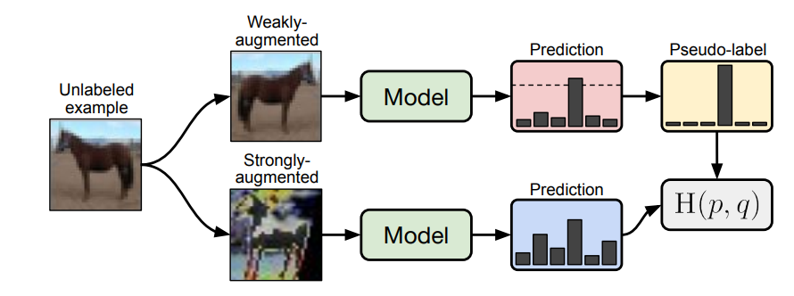

[arxiv](http://arxiv.org/abs/2001.07685), [github](https://github.com/google-research/fixmatch)

## どんなもの？

半教師あり学習において、ラベルなし画像に「弱い」データ拡張を与えた画像の one-hot 疑似ラベルと、「強い」データ拡張を与えた画像の予測とのクロスエントロピーロスをとるように学習させる手法を提案。CIFAR-10において250個のラベルありデータから正解率94.94%を達成（先行研究は93.73%）。

## 先行研究と比べてどこがすごい？

-   CIFAR-10においては、先行研究（ReMix Match）に圧勝

## 技術や手法のキモはどこにある？

- 最初は弱いデータ拡張で予測し、疑似ラベルを作成
- 次に、強いデータ拡張をしたデータでも、予測結果を崩さないように学習

### 他手法との比較

*UDAとReMixMatchは本著者グループの先行研究。*

### weakly augmentation

最初に通常通り、左右反転等の弱いデータ拡張を与えたラベルなし画像に対して予測します。

次に **疑似ラベル（pseudo-label）** を作成します。一番確信度が高いラベルの予測値が閾値を超えたラベルのみを1, その他のラベルを0とするように one-hot vector 化します。

### strongly augmentation

強いデータ拡張には、**RandAugment** か **CTAugment** の適切な方を用います。 ２つとも **AutoAugment** の一種であり、 最適なデータ拡張を探索する分野の技術です。どちらが良いかは明記されておらず、予測結果で判断するようです（要はどっちもやれということ）。

強いデータ拡張をしたデータセットに対し、通常通り教師あり image classification を行い、cross-entropy loss を導出します。強いデータ拡張の一種として [Cutout](https://arxiv.org/abs/1708.04552) を用いました。ランダムに矩形で塗りつぶすようなデータ拡張手法です。

*Cutout とほぼ同一の成果として Random Erasing があります。Random Erasing の方が名前がわかりやすい。*

### Training

weak/strong dataaugmentation のそれぞれで出した loss を係数付きで合算し、全体 loss として最適化します。全体の疑似コードは以下になります。

## どうやって有効だと検証した？

### 定量評価

先行研究（ReMixMatch）に辛勝しました。とはいっても、ReMixMatchはこの著者グループの2カ月前の手法です。ラベル付与割合が高いとReMixMatchよりエラー率が高くなる場合があるようです。

*他手法とのエラー率の比較。RA; Random Augmentation, CTA; ReMixMatchで用いていたデータ拡張手法です。また、例えばCIFAR10において40labelsとは、10クラスで40枚なので1クラスあたり4枚のラベル付けをしたという意味です。*

### 各クラス１枚のラベルだけで学習させる

半教師あり学習の極限設定として、各クラス１枚のみ学習させる状況を考えてみます。CIFAR-10でランダムに10枚のみラベル付与をしたデータセットを4つ作成し、各4回学習させました （少なっ！）。結果、48.58%~85.32%のtest accuracyが得られ、中央値が64.28%でした。ただ、データセットごとの精度ばらつきは小さく、１つ目のデータセットでは61%~67%、2つ目では68%~75%でした。

データセットごとに精度ばらつきが出る原因として、各ラベルサンプル1枚の画像の質が大きく関係していると仮説を立てました。仮説検証のために、距離学習を用いて、そのクラスを最も代表するデータから最も代表しないデータの順に８グループに分け、そのグループ内でデータセットを作ったときの精度を検証しました。

結果、最も代表するグループでは中央値78%（最高84%）、中位のものでは65%、外れ値では10%となり、データセットの質が大きく影響することがわかります。考えれば当たり前のことで、各クラス１枚しかないのですから、その１枚がビミョーだったらモデルが特徴を捉え切れるはずもありませんね。

## 議論はあるか？

-   データセットのごく少数（1%以下）にしかラベルがない場合に、本手法は特に有効に働く？
-   非常に単純だが強力な手法

## 次に読むべき論文はあるか？

-   D. Berthelot et al., "ReMixMatch: Semi-Supervised Learning with Distribution Alignment and Augmentation Anchoring", 2019 Nov.
    -   先行研究その①：ReMixMatch（Google Research）
    -   CTAugment は ReMixMatch で追加された要素
-   Q. Xie et al., "Unsupervised Data Augmentation for Consistency Training", 2019 Sep.
    -   先行研究その②：UDA（Google Research）
-   [Ekin D. Cubuk et al., "RandAugment: Practical automated data augmentation with a reduced search space," 2019](https://arxiv.org/abs/1909.13719)
-   [CIFAR-10を疑似ラベル（Pseudo-Label）を使った半教師あり学習で分類する](https://qiita.com/koshian2/items/f4a458466b15bb91c7cb)
