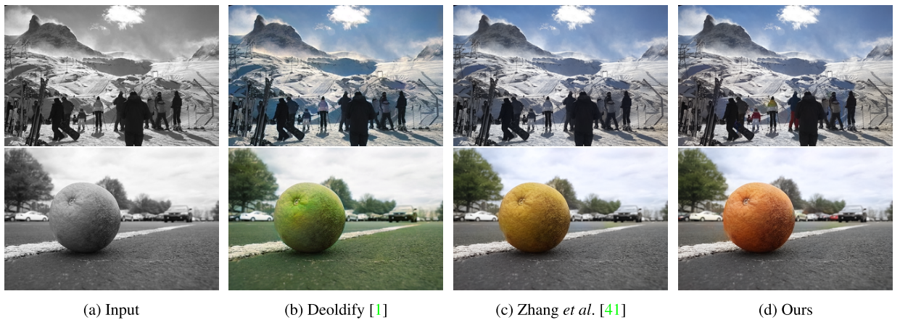
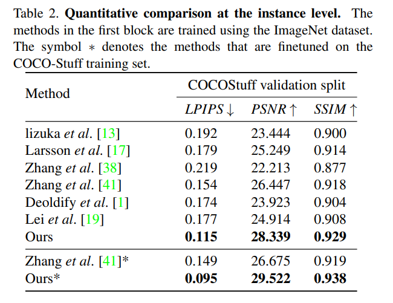
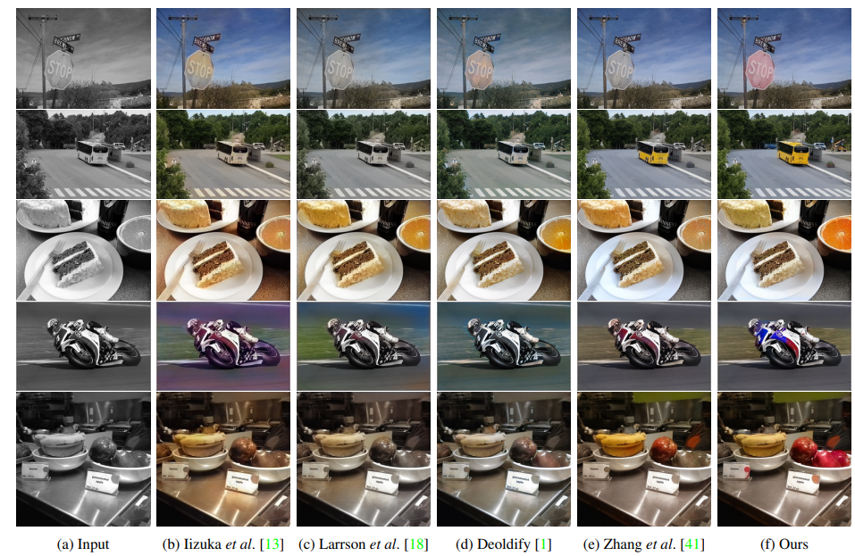
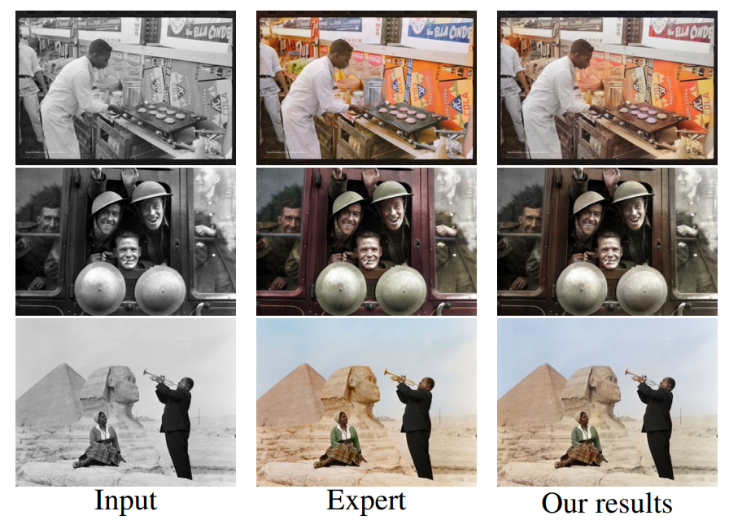
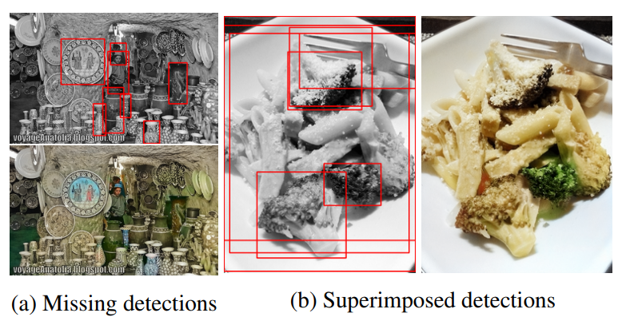

[arxiv](https://arxiv.org/abs/2005.10825), [github(official)](https://github.com/ericsujw/InstColorization), [project](https://ericsujw.github.io/InstColorization/)

## どんなもの？

学習済み物体検出モデル（今回はMask R-CNN）で検出したオブジェクトごとに着色することで、オブジェクトと背景との分離を明確にし、より高精度にend-to-endで着色を行えるようにする手法を提案しました。

## 先行研究と比べてどこがすごい？

-   検出したオブジェクトごとに着色するアプローチ
-   上記オブジェクトごとの着色画像と、全体着色画像との合成画像を作る新機構

## 技術や手法のキモはどこにある？

本手法は以下の４つの構成要素からなります。

-   Object Detection｜事前学習済み物体検出モデル（Mask R-CNN）によりオブジェクト検出
-   Instance Colorization｜上記で検出したオブジェクトごとに着色
-   Full-image Colorization｜画像全体を着色
-   Fusion Model｜Instance ColorizationとFull-image Colorizationの結果を合わせた合成画像を作成

以下のような順番で学習していきます。

1.  full-image colorization network を学習
2.  1.で学習した重みをinstance colorization network の初期値に設定
3.  instance colorization network を学習
4.  full-image model と instance model の重みを固定
5.  fusion module を実行

### Object Detection

今回はMask R-CNNを用いたようです。選定理由は明記されていませんが、今後instance segmentation方向で研究を発展させていくためでしょうか。

各オブジェクトのbounding box座標 $B_i$ を検出し、input imageからクロップします。なお、クロップされた画像は 256x256 に rescale されます。

### Image Colorization & Full-image Colorization

後の処理で特徴マップをマージする必要があるため、2つは同じネットワーク構造をしています（もちろん重みは異なります）。backboneとして [Zhang et al., SIGGRAPH 2017](https://arxiv.org/abs/1705.02999) のアーキテクチャを採用しました。

損失関数には Zhang et al., SIGGRAPH 2017 と同様、 smooth-L1 loss ($\delta=1$) を用いました。

$$
l_\delta(x, y) = \frac{1}{2}(x−y)^2\ L1_{\{|x−y|<δ\}} +δ(|x−y| − \frac{1}{2}δ) L1_{\{|x−y|>δ\}}
$$

### Fusion Module

先ほどのネットワークのj番目のレイヤから特徴量を引っ張ってきます。３層ほどのCNNで特徴マップを生成しました。

$$
f_j^{\bar{X}} = f_j^X \circ W_F + \sum_{i=1}^{N} f_j^{\bar{X_i}} \circ \bar{W_I^i}
$$

## どうやって有効だと検証した？

### 実験環境

-   Dataset｜ImageNet, CocoStuff, Places205
-   1枚のRTX 2080Tiを積んだデスクトップでImageNetは3日学習

### 画像全体での定量評価

*矢印の向きが指標の良さの向きを表しています。*

評価指標は LPIPS, PSNR, SSIMを用いました。全評価指標及びデータセットにおいて、先行研究を上回る結果でした（地味にスゴイ）。

### オブジェクトレベルでの定量評価

### 定性評価

提案手法がオブジェクトごとに最も適切な色を塗れているようです（ユーザスコアはなし）。オレンジがスゴイ瑞々しいですね。

### 推論時間

平均 0.187s/枚 でした。※Intel i9-7900X, 32GB RAM, RTX 2080Ti, 256x256 

### ヒトの着色結果との比較

左列が入力画像、中央列がヒトによる着色結果、右列が本手法による着色結果です。人工的に生成した白黒画像だけではなく、古い劣化した写真でもほぼヒトに近い結果で着色できるようです。

## 議論はあるか？

本手法の自然な発展として、以下が考えられます。特に Mask R-CNN をバックボーンに用いているあたり、お次は instance segmentation で発表してきそうです。
-   semantic/instance segmentation情報を用いる
-   class informationをinstance colorizationに用いる

### failure cases

（a）物体検出がうまくいかないとき、（b）各オブジェクトの領域の重複が多いとき に失敗するようです。

考えれば当然の話ですね。物体検出を組み込んだことで着色精度を向上させた研究で、物体検出ができなかったらそりゃ失敗するでしょう。また、物体が重複している場合もまた物体検出を行いにくい状況です。

## 6. 次に読むべき論文はあるか？

-   [R. Chang et al., "Real-Time User-Guided Image Colorization with Learned Deep Priors, " SIGGRAPH 2017](https://arxiv.org/abs/1705.02999)
    -   メインの引用＆比較論文