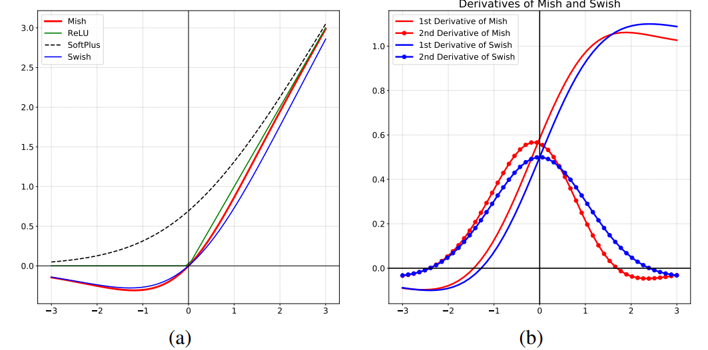

[arxiv](https://arxiv.org/abs/1908.08681), [github(official)](https://github.com/digantamisra98/Mish)

## どんなもの？

活性化関数ReLU/Swishの後継であるMishを提案。下に有界、負の値も取る、無限微分可能、lossも滑らかになり最適化しやすいという特徴があります。

## 先行研究と比べてどこがすごい？

多くのタスク、ネットワークにおいてReLU/Swishを上回っています。また、使用している活性化関数を Mish に置換するだけなので導入も簡単です。

## 技術や手法のキモはどこにある？

### Mish関数の定義

Mish関数は以下の式で定義されます。
$$
f(x) = x \tanh(softplus(x)) = x \tanh(\ln(1+e^x))
$$

$$
f'(x)=\frac{e^x[4(x+1) + 4e^{2x}+e^{3x}+e^x(4x+6)]}{(2e^x+e^{2x}+2)^2}
$$

### Mish関数の特徴

Mish関数には、1）負の値を保持、2）下に有界、3）無限回微分まで連続、4）output landscape が滑らか という特徴があります。1）~3）の特徴は Swish が有していましたが、4）が Mish 関数の強みですね。

#### 負の値を保持

Mish関数は $[≈-0.31, ∞)$ で定義されます。負の情報が若干保存されているため、**dyling ReLU 現象が発生しにくい** ようです。「関数設計的に dying ReLU の必要条件を排除した」とのことです。

dying ReLU 現象とは、勾配がなくなるニューロンが発生する現象であり、ReLU の負領域では勾配がゼロになることが原因です。学習時に大きく負側に重みが更新された場合、ReLUで活性化しなくなります。この dying ReLU 現象が Mish 関数では起きにくいようです。

また、負の値を保持することで、強い正則化の効果もあるようです。

#### 下に有界

上限がないため、sigmoid や tanh のような飽和がありません、これにより勾配がほぼゼロになることがなく、学習が促進されます。また、強い正則化効果をもたらします（？）。

#### 無限回微分が可能

Mish関数は無限回微分可能であり、特異点（local minimaのこと？）の回避に貢献します。

#### output landscapeが滑らか

Mish 関数により、モデルの output landscape, 引いては loss landscape も滑らかになり、最適化と一般化が容易になります。

*5層 NN の output landscape です。ReLU（左）とMish（右）の output landscape の滑らかさの比較*

## どうやって有効だと検証した？

### Ablation Study on CIFAR-10 and MNIST

下図 (a) は **層の深さに対する安定性** を主張しています。MNIST に対して、赤実線の Swish は層が深くなっても accuracy が低下していませんね。一方、青実線の Swish や 黒実線の ReLU は急激に accuracy が低下していきます。

下図 (b), (c)では **Swish/ReLU よりロバストであること** を主張しています。図 (b) はデータセットに加えたガウシアンノイズの標準偏差に対する test loss を表しています。もちろん loss は増加しますが、Mish は Swish/ReLU と比較して loss の増加が抑えられています。図 (c) から様々なノイズ付与方法に対しても、 Mish の accuracy の低下が抑えられていることがわかります。

### Statistical Analysis

CIFAR-10 に対し、Squeeze Net を23回学習させたときの平均 accuracy, 平均 loss, accuracy の標準偏差の一覧です。Mish が最も平均 accuracy が高く（一応）、標準偏差も小さく学習が安定しています。

### ImageNet-1k

ImageNet と様々なバックボーンで学習させました。Top-5 が得意な ReLU, Top-1 が得意な Swish のいいとこどりをしたような結果ですね。

### MS-COCO Object Detection

なんともいえないビミョーな結果です。

## 議論はあるか？

### 速度に難あり

当たり前ですが、機構が単純な ReLU と比べると約 3 倍の forward/backward time がかかっています。どのタスクでも比較的良い性能を誇ってきた Mish の欠点ともいえます。

*GPUはRTX2070を使用。ReLU-CUDA の結果も載せてほしいです。*

## 次に読むべき論文はあるか？

-   P. Ramachandran et al., "Searching for Activation Functions, " 2017
    -   [arxiv](https://arxiv.org/abs/1710.05941)
    -   目の敵にされていた Swish の元論文。