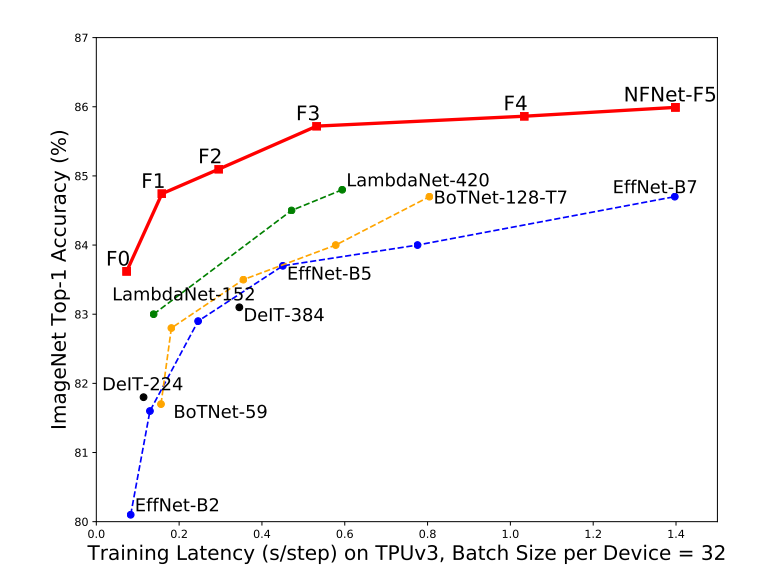
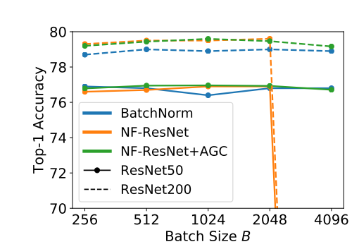
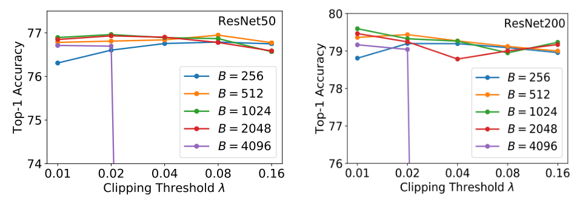
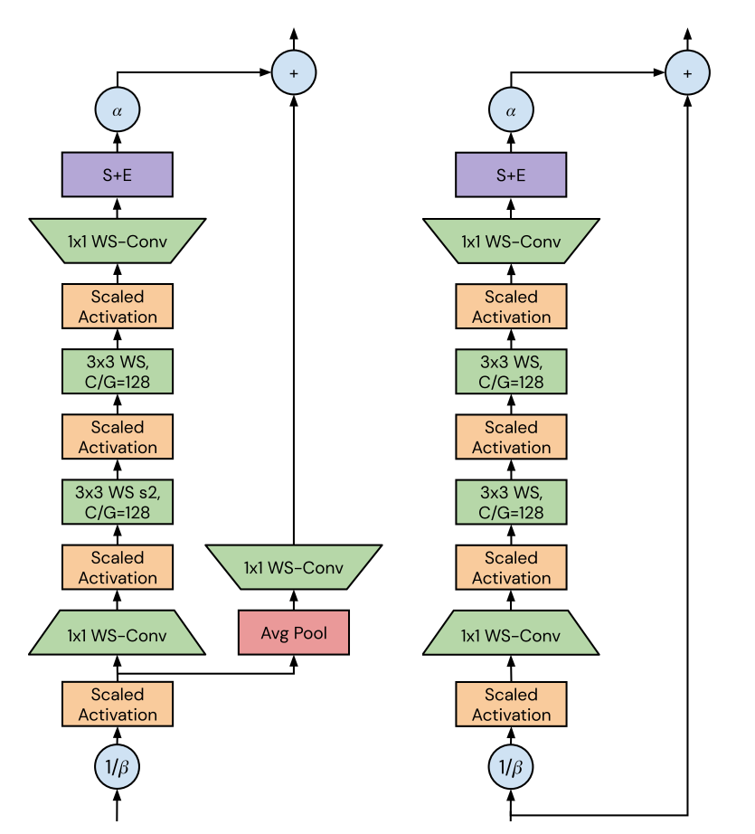
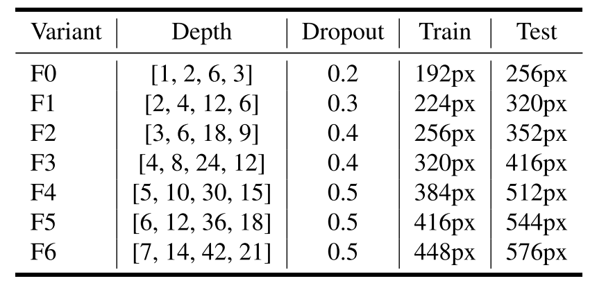
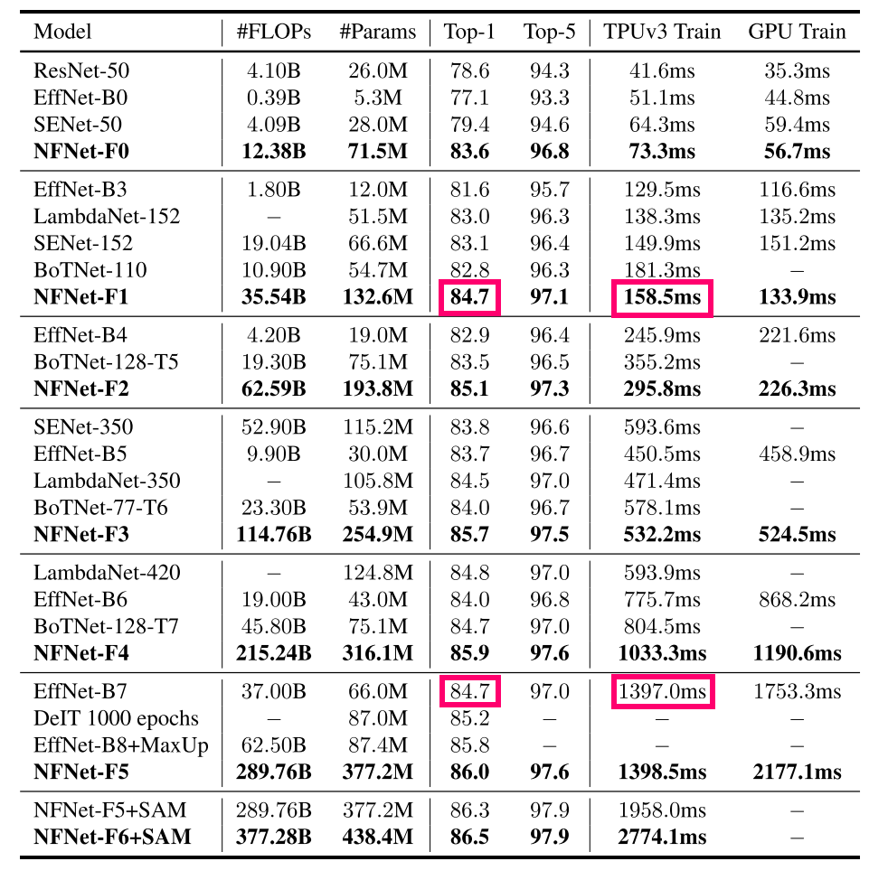

[arxiv](https://arxiv.org/abs/2102.06171), [github(official tf2)](https://github.com/deepmind/deepmind-research/tree/master/nfnets)

## どんなもの？

BNの主な３つの問題である「計算量が大きい」「学習時と推論時とでモデルの挙動が異なる」「ミニバッチ間の独立性を破壊する」を解決するNFNets（Normalize-Free ResNets）を提唱しました。ImageNetでSOTAである86.5%を達成し、EfficientNet-B7より学習時間は8.7倍も高速です。

*NFNet-F5はEffNet-B7とほぼ同等のtraining latencyですが、top-1 acc on ImageNetは約2%上回っています。*

## 先行研究と比べてどこがすごい？

BNとその弊害を除去し、学習を安定化かつ高速化させるAdaptive Gradient Clippingを提唱した点。

## 技術や手法のキモはどこにある？

### Adaptive Gradient Clipping

本論文では、従来手法であるGradient Clippingを発展させた **Adaptive Gradient Clipping** により、学習速度を加速させようと試みました。

Gradient Clipping（勾配クリッピング）とは、勾配爆発を防ぐ手法の一つであり、言語モデリングの学習安定化によく使われています。勾配のノルムが事前に設定した閾値を超えた場合、その閾値以下となるように勾配のノルムを正規化する手法であり、以下の式で定義されます。

$$
G \rightarrow 
\begin{cases}
\lambda \frac{G}{|G|} & if |G| > \lambda,  \\\\\\
G & otherwise.
\end{cases}
$$

ここで、$G=\partial L/\partial \theta$ は勾配ベクトル、$L$ はloss, $\theta$ はモデルパラメータを表します。Gradient Boostingにより大きなバッチサイズを設定できるため、学習を加速させる効果があります。しかし、Gradient Clippingはヒューリスティックな方法であり、閾値 $\lambda$ に非常に敏感に反応します。そのため、よりロバストに閾値 $\lambda$ を決定できる手法が求められていました。

そこで本論文では **Adaptive Gradient Clipping (AGC)** を提案します（ガラスメーカではありません笑）。AGCでは重みと勾配の比率に対して、勾配のクリッピングを行います。
$$
G \rightarrow 
\begin{cases}
\lambda \frac{||W_i^l||_F^\*}{||G_i^l||_F} G_i^l & if \frac{||W_i^l||_F^\*}{||G_i^l||_F} > \lambda,  \\\\\\
G_i^l & otherwise.
\end{cases}
$$

ここで、$W^l$ は第 $l$ 層目の重み行列、$G^l$ は第 $l$ 層目の勾配、$|\cdot|_F$ は [Frobeniusノルム](https://ja.wikipedia.org/wiki/%E8%A1%8C%E5%88%97%E3%83%8E%E3%83%AB%E3%83%A0#%E3%83%95%E3%83%AD%E3%83%99%E3%83%8B%E3%82%A6%E3%82%B9%E3%83%8E%E3%83%AB%E3%83%A0) を表します。また、$i$ は$G_l$ の $i$ 番目行を表します。

下図より、バッチサイズが4096と巨大になってもAGCを加えたNF-ResNetは安定した学習が行えています。

AGCでも閾値 $\lambda$ はハイパーパラメータとして残りますが、バッチサイズが大きいほど小さく設定すれば良いことが経験的にわかっています。バッチサイズが4096ならば $\lambda=0.01$ にすればいいようです。

ただ、AGCは全結合層のLinear層には適用しない方が良いらしいです。筆者も理由はよくわかっていないようです。

### Network Architecture

NFNetsはGELU関数を採用した **SE-ResNeXt-D** をベースモデルとしています。

1. stem
2. stage1
3. stage2
4. stage3
5. stage4
6. classifier

stemはconv層からなる局所特徴を抽出します。stage1~4がメイン部分であり、各レイヤのブロック数は $[N, 2N, 6N, 3N]$ 個からなります。stage2, 3が左図、stage1, 4が右図となります。アーキテクチャの工夫点はappendixにも書かれていますので見ておいてください（なげやり）。

### Network Family

## どうやって有効だと検証した？

### ImageNet Accuracy

バッチサイズ4096でImageNetを360epochs学習させました。ファミリー内では従来手法より良い精度であることがわかります。また、NfNet-F1とEffNet-B7はほぼ同等の精度ですが、学習時間は8.7倍高速になっています（赤四角）。

*モデルサイズは巨大だなぁ…。*

## 議論はあるか？

## 次に読むべき論文はあるか？

