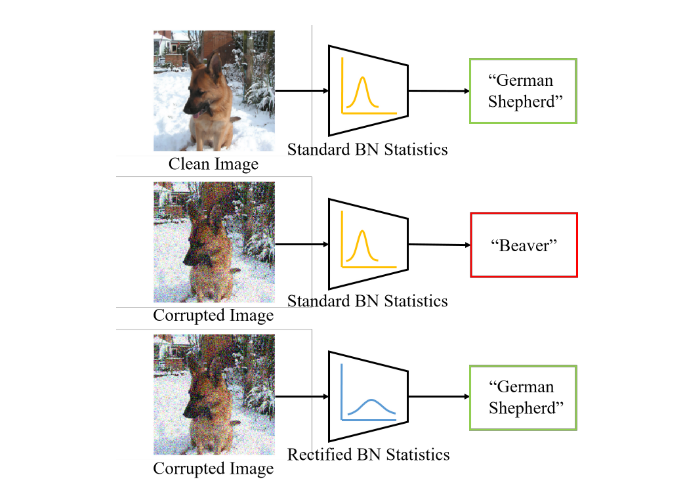
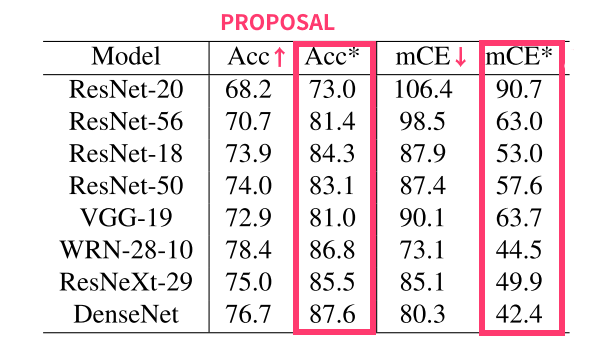
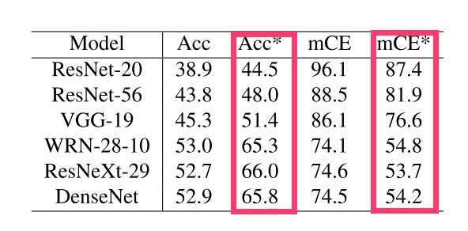
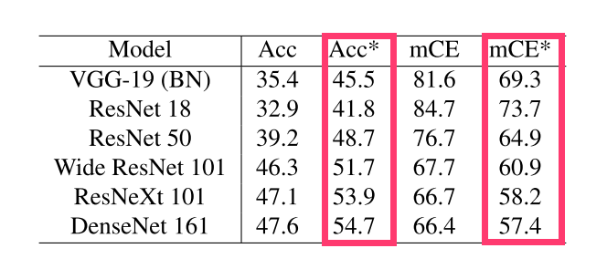
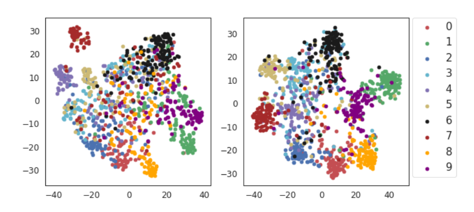

[arxiv](https://arxiv.org/abs/2010.03630)

## どんなもの？

ガウシアンノイズやブレ等の破損した画像に対してもロバストにはたらくRectified Batch Normalizationを提唱しました。

## 先行研究と比べてどこがすごい？

- モデルのロバスト性をdomain adaptationの問題として解釈しました。
- SOTAである"DeepAugment + AugMix"の正解率58.1%を上回る63.3%を達成しました。

## どうやって有効だと検証した？

### CIFAR10-CとCIFAR100-Cでの実験結果

*米印付きが提案手法です。*

試したモデルにおいてaccuracyが5%~10%向上しています。mCEは[Hendrycks et al.](https://arxiv.org/pdf/1807.01697.pdf)で提唱されたmean Corruption Errorという指標であり、値が低いほど良い指標となります。mCEは以下式で定義されます。
$$
CE_C^f = \frac{\sum_{s=1}^5 E_{s,c}^f}{\sum_{s=1}^5 E_{s,c}^{AlexNet}}
$$
ここで、$E_{s,c}^f$ はモデル $f$ における、破損 $c$ を５段階の破損度 $s$ で適用した場合のエラー率を表します。破損間の難易度を是正するために、AlexNetのエラーで割り、難易度を調整します。

CIFAR100-Cの結果を以下の表に示します。容量の大きいモデルは初期精度が50%以上と高いですが、提案手法適用によりさらに精度が12%以上向上しています。

### ImageNet-Cでの実験結果

### t-SNEでの可視化結果

左図が従来手法、右図が提案手法での可視化結果です。色の違いはクラスです。提案手法の方がより色が固まっている（クラスタの分散が小さい）ことがわかります。

## 次に読むべき論文はあるか？

- A. Brock et al., "High-Performance Large-Scale Image Recognition Without Normalization, " 2021
  - [arxiv](https://arxiv.org/abs/2102.06171), [github](https://github.com/deepmind/deepmind-research/tree/master/nfnets)
  - Batch NormalizationなしでSOTAの画像分類モデルを提唱。EfficientNetより8.7%高速。