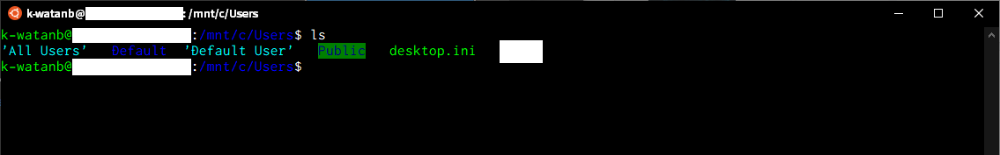
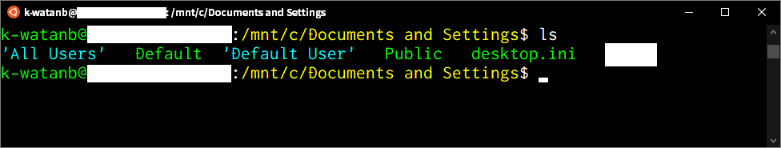
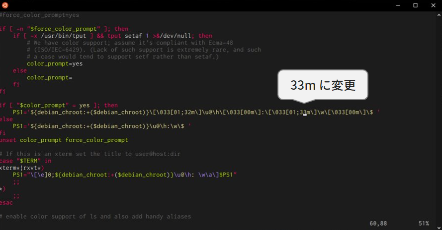

## WSLの初期カラーは見にくい！

WSL君、初期のカラースキーム（文字色）はかなり見にくいです。```vim```や```ls```したときに黒背景に青文字だったり、緑背景だったり…。



本記事ではカラースキームを調整し、視認性の良いターミナル環境を構築します。



以下の順番で何とかしていきましょう。

1. vim
2. ls
3. ディレクトリ階層

## vimのカラースキーム設定


まずは vim を見やすくしましょう。今回は monokai のカラースキームに設定します。

```bash
$ mkdir ~/.vim
$ mkdir ~/.vim/colors
$ git clone https://github.com/crusoexia/vim-monokai
$ cp vim-monokai/colors/monokai.vim ~/.vim/colors
```

gitが使えない方は、配布先から直接 zip をダウンロードしてください。
https://github.com/crusoexia/vim-monokai

次にmonokaiを適用させます。vimで設定ファイルを新規作成後、保存してください（```Shift + Z```を2回押しで保存）。

```bash
$ vim ~/.vimrc
```

```bash
syntax on
colorscheme monokai
```

これで設定完了です。適当なファイルをvimで開き、カラースキームの適用を確認しましょう。

```bash
$ vim ~/.bashrc
```

## lsのカラースキーム設定

次は```ls```のカラースキーム設定をしましょう。配布されているカラースキームを適用してもいいですが、面倒なので内部を直接いじります。まずは現状のカラースキーム設定を書き出しましょう。

```bash
$ dircolors -p > ~/.dircolors
```

その後設定ファイルを編集します。

```bash
$ vim ~/.dircolors
```

以下の部分を変更後、保存してください。

```bash
DIR 01;32
STRICKY_OTHER_WRITABLE 01;32
OTHER_WRITABLE 01;32
```
なお、各数字は以下の関係になっています。お好みの色に設定してください。各要素はセミコロンで結んでください。

```bash
# Attribute codes:
# 00=none 01=bold 04=underscore 05=blink 07=reverse 08=concealed
# Text color codes:
# 30=black 31=red 32=green 33=yellow 34=blue 35=magenta 36=cyan 37=white
# Background color codes:
# 40=black 41=red 42=green 43=yellow 44=blue 45=magenta 46=cyan 47=white
```

これで```ls```のカラースキーム設定は完了しました。設定を再読み込みし、反映されているか確認しましょう。

```bash
$ source ~/.bashrc
```

## ディレクトリ階層のカラースキーム設定

最後に現在のディレクトリ階層部分のカラーを設定しましょう。これも黒背景に青文字で非常に見にくいです。

きれいになった```vim```で```.bashrc```を編集します。

```bash
$ vim ~/.bashrc
```

60行目付近の```[01;34m\]```を```[01;33m\]``` に変更し、保存してください。



```.bashrc```を再読み込みしましょう。

```bash
$ source ~/.bashrc
```

これでディレクトリ階層は黄色文字になっているはずです。お好みで好きな色に設定してください。


## さいごに

[Windows Terminal](https://docs.microsoft.com/ja-jp/windows/terminal/) を使ってもカラースキーマをなんとかできるよう。